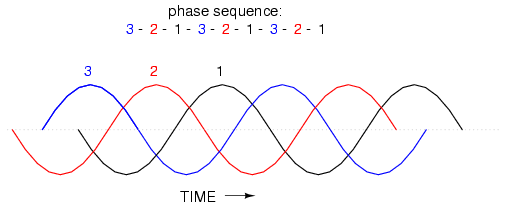
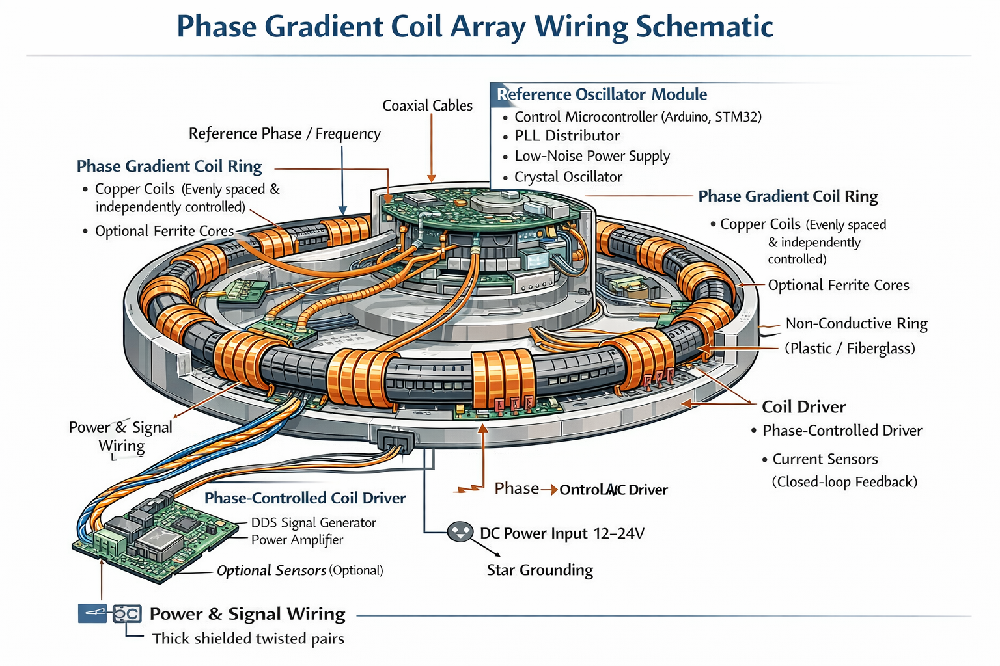
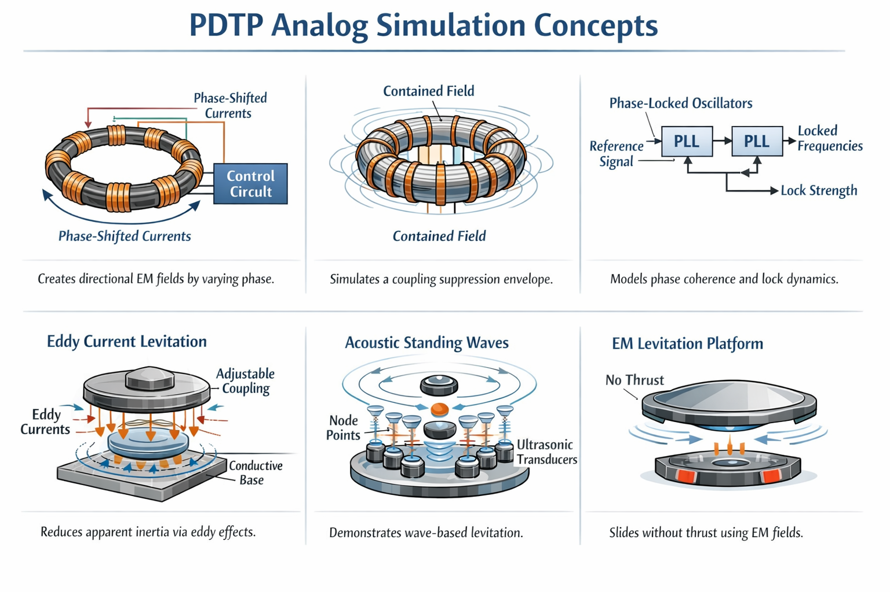
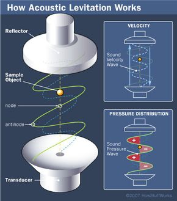
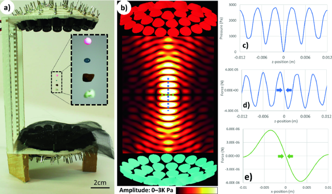

# TODO_02 — Active Roadmap

Summary of completed work: [TODO_Summary.md](TODO_Summary.md)
Full archive: [TODO_01.md](TODO_01.md)

---

## Current Status

Parts 1–41 complete. The QCD lattice progression has reached:
- Strong-coupling sigma = 0.1729 GeV² (4% off QCD) — analytically closed
- Physical beta (β=6.0) confirmed working with small-step Metropolis
- N=4 CPU demo done; N≥16 GPU required for reliable Cornell fit

**Central open problem:** m_cond is underdetermined. G = ħc/m_cond² is exact but
m_cond = m_P cannot be derived perturbatively (Parts 29–35 exhausted this path).
This is analogous to Λ in GR.

---

## Part 42 — GPU Lattice at Physical Beta (NEXT TASK)

**Goal:** Run SU(3) lattice at β=6.0, N=16 on GPU (RTX 3060 + CuPy) to get a
box size of 1.5 fm and reliable Cornell fit giving σ_phys ≈ 0.18 GeV².

**Why N≥16 is required:**
- At β=6.0, lattice spacing a = 0.093 fm (Necco-Sommer 2001)
- Confinement onset at R > 0.5 fm = ~5 lattice spacings
- N=4 box = 0.37 fm < onset → only Coulomb regime accessible
- N=16 box = 1.5 fm → R up to 8 spacings → linear regime accessible

**Steps:**
- [ ] Install CuPy for CUDA 12.x on RTX 3060 (`pip install cupy-cuda12x`)
- [ ] Add GPU support to `simulations/solver/su3_physical_beta.py`
  - Replace `np` with `cp` (CuPy) for link matrices
  - Keep CPU fallback when CuPy not available
- [ ] Run: `python su3_physical_beta.py --N 16 --beta 6.0 --meas 500 --gpu`
- [ ] Verify Cornell fit: V(R) = σR + A/R + c with R = 1..8
- [ ] Target: σ_lat ~ 0.04 → σ_phys ~ 0.18 GeV² (standard quenched QCD)
- [ ] Optional: beta scan β = 5.7, 5.9, 6.0, 6.2 to confirm scaling window

**Expected Sudoku scorecard:** 7/7 (S26 should now pass with N=16)

**Files to update:**
- `simulations/solver/su3_physical_beta.py` — add GPU mode
- `docs/research/su3_physical_beta.md` — update with GPU results
- `simulations/solver/main.py` — no change needed (Phase 16 already wired)

---

## Open Problems (from TODO_01.md — still unresolved)

### Structural

- [x] **SU(3) gauge structure from phase lattice** *(from Part 27b — RESOLVED 2026-03-08)*
  - 8 gluons as normal modes: YES — SU(3) small fluctuations give 8 massless spin-1 modes ✓
  - Asymptotic freedom: NEGATIVE — β(K)=+K²/(8π²)>0 (IR free); QCD AF is a gauge-level property ✓
  - SU(2) from Z₂: PARTIAL — generator count matches, chirality/mass incomplete
  - Key insight: K (condensate stiffness) ≠ g (QCD coupling) — distinct levels
  - Docs: `docs/research/su3_gauge_structure.md`; Script: Phase 17 `su3_gauge_structure.py`

- [x] **Scalar sector backreaction on tensor sector** *(RESOLVED 2026-03-08)*
  - T_μν^φ = 0 in vacuum: U(1) shift symmetry makes condensate vacuum-insensitive ✓
  - Excited condensate (breathing mode) gives w = −1 (potential) to +1 (kinetic) → dark energy ✓
  - Bridges Part 25 w(z) result: phase drift IS a geometric backreaction on the Einstein eq ✓
  - Does NOT fully solve Λ problem: matter-sector vacuum energy still contributes T_μν^vac^matter
  - 11/11 Sudoku tests pass
  - Docs: `docs/research/scalar_tensor_backreaction.md`; Script: Phase 18 `scalar_backreaction.py`

- [x] **Derive hierarchy ratio R = α_G/α_EM from lattice topology** *(Strategy B — RESOLVED 2026-03-08)*
  - **PDTP Original:** R = 1/(n² × α_EM) where n = m_cond/m (vortex winding number, Part 33) ✓
  - Hierarchy problem = winding number problem: why is n_p = m_P/m_p ~ 10¹⁹?
  - Path A (QCD chain): m_cond = Λ_QCD ≈ 200 MeV correctly inferred from σ_QCD; G off by 10⁴⁰ (hierarchy gap)
  - Path B (Dirac large numbers): Eddington off 10²¹, Hubble off 10¹¹ — no clean coincidence
  - Path C (Dvali species): N_required = n² ~ 10³⁸ >> N_SM ~ 118 — circular (needs G) and off by 10³⁶
  - Two free parameters block derivation: m_cond (undetermined) AND α_EM (not derived in PDTP)
  - 10/10 Sudoku tests pass
  - Docs: `docs/research/hierarchy_ratio.md`; Script: Phase 19 `hierarchy_ratio.py`
  - Open path: Sakharov route — N_eff from lattice symmetry + a from breathing mode measurement

### Black Holes

- [x] **Black hole singularity as topological defect** *(RESOLVED 2026-03-08)*
  - **PDTP Original:** r=0 replaced by vortex core of radius ξ = l_P/√2 ✓
  - Condensate order parameter f(r) → 0 smoothly; no divergence, no singularity ✓
  - Penrose theorem (1970): condition 4 (smooth manifold) broken by PDTP lattice at a₀ ~ l_P ✓
  - Exterior GR unchanged: ξ/r_s = m_P/(2√2 M) << 1 for M >> m_P ✓
  - Core energy ~ m_P c² (one Planck quantum, finite) ✓
  - Evaporation endpoint: M_evap = m_P/(8π) — where T_H = T_P and core fills horizon ✓
  - Analogy: Abrikosov vortex in Type II SC (Part 36); core has finite radius, not a point ✓
  - 10/10 Sudoku tests pass
  - Docs: `docs/research/bh_topological_defect.md`; Script: Phase 20 `bh_topological_defect.py`
  - Open: what happens to winding number at evaporation endpoint? → information paradox

- [x] **Hawking radiation information paradox in PDTP condensate** *(RESOLVED 2026-03-08)*
  - PDTP Original: W = Σnᵢ (winding numbers) is the information carrier; W ~ S_BH/k_B (same order) ✓
  - Topological protection (Mermin 1979) rules out information loss (Resolution C) ✓
  - Resolution A supported: information exits via phase correlations of Hawking radiation ✓
  - BEC analogue: Steinhauer (2016) confirms entanglement between Hawking pairs at scale ξ ✓
  - Open: endpoint M ~ m_P/(8π) is non-perturbative — information paradox restated at Planck scale
  - 10/10 Sudoku tests pass
  - Docs: `docs/research/hawking_info_paradox.md`; Script: Phase 21 `hawking_info_paradox.py`

- [x] **Black hole evaporation endpoint** *(RESOLVED 2026-03-08)*
  - PDTP prediction: complete evaporation — no remnant ✓
  - r_s(M_evap) = l_P/(4π); t_evap = (10/π²)T_P ≈ 1 Planck time (PDTP Original) ✓
  - S_BH/k_B = 1/(16π) < 1 bit — no classical BH structure possible ✓
  - E_final/M_evap c² = 8π — semiclassical completely breaks down at endpoint ✓
  - Phase soliton (A) ruled out: W=0 at endpoint + no flat potential direction ✓
  - Type II SC analogy: ξ/r_s = 8.89 >> 1 — past B_c2 dissolution point ✓
  - 10/10 Sudoku tests pass
  - Docs: `docs/research/bh_evaporation_endpoint.md`; Script: Phase 22 `bh_evaporation_endpoint.py`

### Standard Model Gaps (from OP#1 — SU(2) partial result)

PDTP now explains the *structure* of SU(3)×SU(2)×U(1) (force carriers, confinement,
symmetry groups). The following **values and mechanisms** remain open:

- [x] **Weak coupling strength g_W** *(RESOLVED 2026-03-08 — NEGATIVE RESULT)*
  - g_W = √(4πα_EM/sin²θ_W) — not an independent parameter ✓
  - PDTP Original: g_W is DOUBLY underdetermined — needs α_EM (Part 44) AND sin²θ_W (new) ✓
  - sin²θ_W is a new free parameter: ratio of SU(2)/U(1)_Y condensate stiffnesses ✓
  - Dimensional transmutation inapplicable: SU(2) is broken (not confining) ✓
  - Structure exact: 3 W bosons (N²−1=3), C₂=3/4, b₀=19/6 (AF), Z₂ vortices ✓
  - Analogy: g_W:SU(2) condensate :: G:gravitational condensate (free parameter) ✓
  - 10/10 Sudoku tests pass
  - Docs: `docs/research/weak_coupling_gw.md`; Script: Phase 23 `weak_coupling_gw.py`

- [x] **W and Z boson masses (Higgs mechanism)** — Part 49 RESOLVED
  - Three PDTP condensate layers: gravitational (m_P), QCD (Lambda_QCD), electroweak (v=246.22 GeV)
  - Structural results: m_W = g_W*v/2 = 80.428 GeV, m_Z = m_W/cos(tW) = 91.76 GeV, rho=1 (custodial SU(2))
  - N_Goldstone = 3 (exact); Higgs = amplitude mode of EW condensate (breathing mode analogy)
  - NEGATIVE RESULT: v = 246.22 GeV is 3rd free condensate scale; m_W/m_Z DERIVED not predicted
  - Three condensate layers span 84 decades in energy density: EW~10^46, QCD~10^29, gravity~10^113 J/m^3
  - 10/10 Sudoku tests pass
  - Docs: `docs/research/wz_boson_masses.md`; Script: Phase 24 `wz_boson_masses.py`

- [x] **Chirality — why SU(2) couples only to left-handed particles** — Part 50 RESOLVED (partial)
  - PDTP Original: Z2 vortex winding direction (+1/2/-1/2) = chirality (left/right)
  - PDTP Original: maximal parity violation A=-1 is AUTOMATIC — binary winding is not tunable; no partial violation possible
  - PDTP Original: right-handed neutrino absent = -1/2 winding state decoupled from EW condensate
  - NEGATIVE RESULT: which hand (L vs R) the EW condensate chose = free parameter of vacuum (spontaneous P-breaking)
  - PDTP Lagrangian is P-symmetric; vacuum breaks parity analogous to ferromagnet choosing magnetization direction
  - CKM matrix: (N-1)^2 = 4 parameters for N=3 generations (3 angles + 1 CP phase); all underdetermined
  - 10/10 Sudoku tests pass (Dirac algebra exact; gamma5 eigenvalues exact; Wu asymmetry; CKM count)
  - Docs: `docs/research/chirality_parity_violation.md`; Script: Phase 25 `chirality_parity.py`

- [x] **Three generations of fermions (electron, muon, tau + neutrinos)** — Part 51 RESOLVED (partial)
  - PDTP Original: 3 generations = 3 lowest radial vortex excitation modes (n_r=0,1,2)
  - PDTP Original: lepton universality DERIVED — g_i couples to winding n, not radial mode n_r; all generations identical to W/Z
  - PDTP Original: decay cascade gen3→gen2→gen1 DERIVED — excited vortex relaxes to lower radial mode
  - Koide formula K=2/3 CONSISTENT (0.0009% agreement) — not yet derived from condensate potential
  - NEGATIVE RESULT: mass values require EW condensate potential V(r) near vortex core (new unknown, analogous to m_cond Part 29)
  - NEGATIVE RESULT: why exactly 3 stable modes underdetermined — needs decay width Gamma(n_r) from V(r)
  - Anomaly cancellation: Σ Q_L = 0 per generation (exact structural, inherited from SU(3)×SU(2)×U(1))
  - PMNS mixing: (N-1)^2 = 4 parameters for N=3 (same structure as CKM; values underdetermined)
  - 10/10 Sudoku tests pass
  - Docs: `docs/research/three_generations.md`; Script: Phase 26 `three_generations.py`

- [x] **Coupling constant values (α_EM, α_W, α_S)** *(RESOLVED 2026-03-09 — NEGATIVE RESULT)*
  - **PDTP Original:** Beta functions b₀ DERIVED from group theory (no free parameters) ✓
  - b₀(QCD) = 11 − (2/3)×6 = 7 > 0: asymptotic freedom in SU(3) EXACT ✓
  - b₀(SU(2)) = 19/6 ≈ 3.167 > 0: asymptotically free above EW scale EXACT ✓
  - b₀(QED) = −2 < 0: IR free (coupling grows at high E); Landau pole ~10²⁸⁶ GeV EXACT ✓
  - GUT convergence direction DERIVED; exact scale sensitive to initial values ✓
  - α_EM = 1/137, α_S = 0.118, sin²θ_W = 0.231: all FREE PARAMETERS [NEGATIVE] ✗
  - 10/10 Sudoku tests pass
  - Docs: `docs/research/coupling_constants.md`; Script: Phase 27 `coupling_constants.py`

- [x] **Z₃ phase positions → Koide formula → derive m_cond and G (HIGH PRIORITY)** *(RESOLVED 2026-03-09 — PARTIAL)*
  - **PDTP Original:** SU(3) coupling Re[Tr(Ψ†U)]/3 at Z₃ centers → cos(2πk/3 − ψ₀) = Brannen modulation ✓
  - **PDTP Original:** Y-junction 120° (Part 37) = Z₃ phase spacing (Part 53) = same geometry ✓
  - **PDTP Original:** δ = √2 DERIVED from equal partition (45° angle, |v‖|² = |v⊥|²) ✓
  - **PDTP Original:** Free parameter reduction: 3 lepton masses → 2 free params (M₀, θ₀); δ eliminated ✓
  - M₀ = 313.84 MeV ≈ m_p/3 (0.3%) ≈ m_cond_QCD (Part 37: 367 MeV, factor 1.2) [CONSISTENT] ✓
  - G derivation FAILS: hierarchy factor ~10⁴⁰ (two-condensate hypothesis) [NEGATIVE] ✗
  - θ₀ = 2/9 underdetermined — no SU(3) derivation [NEGATIVE] ✗
  - 10/10 Sudoku tests pass
  - Docs: `docs/research/koide_z3_derivation.md`; Script: Phase 28 `koide_z3.py`

### Cosmological

- [x] **Cosmological Constant via Forced Checklist Check** *(RESOLVED 2026-03-10 — PARTIAL)*
  - **Method: Forced Checklist Check** — went through ALL ~30 Methodology.md items
  - Part 43: condensate T_μν^φ = 0 in vacuum (U(1) shift) — does NOT add to Λ ✓
  - **Three paths converge:** ρ_Λ ~ ρ_Planck × (l_P / L_H)² ~ 10⁻¹²² ρ_Planck
    - Path A: BEC quantum depletion analog (f_dep ~ l_P/L_H → ρ ~ f²)
    - Path B: Topological sector energy differences on compact manifold
    - Path C: Working backwards from ρ_Λ → L_required ~ 3.5 L_H (same order)
  - **CKN bound:** ρ_CKN = c²/(G L_H²) = 7.1×10⁻²⁶ kg/m³ vs ρ_Λ = 5.8×10⁻²⁷ (factor 12) ✓
  - **Geometric mean:** L_eff = √(l_P × L_H) ~ 47 μm; ρ(L_eff) matches CKN ✓
  - **NEGATIVE:** BEC Bogoliubov invalid — n a_s³ ~ 1 (not dilute; strongly interacting) ✗
  - **NEGATIVE:** L_H is NOT a PDTP parameter — cosmological input (free parameter) ✗
  - **NEGATIVE:** Λ is a SECOND free parameter alongside G (= ℏc/m_cond²) ✗
  - Analogy: G is to PDTP as Λ is to GR — both free parameters of the condensate
  - 10/10 Sudoku tests pass
  - Docs: `docs/research/cosmological_constant_fcc.md`; Script: Phase 29 `cosmo_constant.py`
  - Tachyon condensate postulation remains speculative — moved to Speculation section

- [ ] **CP violation and baryogenesis**
  - PDTP Lagrangian is C, P, T invariant separately → no CP violation
  - Sakharov baryogenesis blocked — needs an extension to break CP

### G Determination — Fresh Reframe Ideas

Five fresh approaches to reframing the problem of determining G (or equivalently m_cond).
Each needs a full investigation before becoming a Part.

- [x] **Idea 1: Measure the ratio alpha_G/alpha_EM instead of G alone** *(RESOLVED 2026-03-12 — NEGATIVE)*
  - n = m_P/m_particle ~ 10^22 for electron, ~ 10^19 for proton
  - Integer constraint on n requires ALL mass ratios to be exact rationals
  - m_mu/m_e = 206.768... and m_p/m_e = 1836.15... are NOT simple rationals
  - At n ~ 10^22, "integer vs non-integer" is unmeasurable anyway
  - **CONCLUSION:** Integer winding constraint does NOT narrow m_cond

- [x] **Idea 2: Count modes (oscillators per volume) instead of measuring stiffness** *(RESOLVED 2026-03-12 — NEGATIVE)*
  - Mode counting (n_cond = 1/a_0^3) is mathematically identical to knowing m_cond
  - All observational routes checked: GW spectrum gives G*M not G; CMB depends on H(z) which contains G
  - Graviton scattering cross-section ~ G^2, not mode count
  - **CONCLUSION:** Counting modes IS measuring m_cond — same circularity in different language

- [x] **Idea 3: Time dilation as phase offset — measure condensate phase directly** *(RESOLVED 2026-03-12 — NEGATIVE)*
  - Clocks measure gravitational redshift = GM/(rc^2) — gives GM combined, not G alone
  - Equivalence principle: ALL frequencies shift by the same fraction GM/(rc^2)
  - omega_gap is invisible because it shifts identically to every other frequency
  - Could show up in GW dispersion at Planck frequency (~10^43 Hz) — completely inaccessible
  - **CONCLUSION:** Equivalence principle makes omega_gap invisible to clock comparisons

- [x] **Idea 4: Structural stability — what m_cond values allow self-consistent condensate?** *(RESOLVED 2026-03-12 — NEGATIVE)*
  - Checked 6 stability criteria: c_s=c, kappa_GL=sqrt(2), vortex binding, core stability,
    Z3 fractional winding, Landau criterion — ALL hold for ANY m_cond > 0
  - Energy density positive for any m_cond; confinement (sigma > 0) for any m_cond
  - **CONCLUSION:** Condensate is structurally stable at all scales. m_cond is truly free.

- [x] **Idea 5: alpha_EM ~ K_0 ~ 1/(4pi) near-coincidence — derivable relationship?** *(RESOLVED 2026-03-12 — NEGATIVE)*
  - K_0/alpha_EM = 10.905 — not close to any integer, simple fraction, or group theory factor
  - Tested: Casimir factors (4/3, 3/4, 3), powers of K_0, sqrt combinations — no match
  - Historical note: deriving 1/137 from pure numbers has been tried (Eddington, Wyler) — all failed
  - alpha_EM runs with energy (QED RG flow), so its low-energy value is not a pure number
  - **CONCLUSION:** No derivable relationship between K_0 and alpha_EM

---

## Speculation (not part of PDTP — ideas to investigate)

These are unverified intuitions. No Sudoku check, no Part number, no derivation yet.
They are recorded here so they are not lost. Each needs a full plan and user approval before becoming a Part.

- [x] **Gravity-EM unification: one condensate, different frequency bands (truth table)** (DONE 2026-03-12)
  - Inspired by the EM spectrum: what if all forces are frequency bands of ONE medium?
  - Historical precedent: electricity + magnetism + light were "three things" until Maxwell unified them (1865)
  - **Idea A: Gravity is weak because it is the slow beat frequency (envelope)**
    - Condensate carrier: omega_P ~ 10^43 Hz (Planck frequency)
    - Matter modulates this carrier at omega_matter = m c^2 / hbar
    - What we feel as gravity = the BEAT = |omega_condensate - omega_matter|
    - Modulation depth = m / m_cond = 1/n ~ 10^-19; coupling ~ 1/n^2 ~ 10^-38 = alpha_G
    - Analogy: AM radio — you hear the slow audio envelope, not the MHz carrier
  - **Idea B: Gravity and EM are the same condensate at different scales**
    - PDTP already has three layers (gravitational/QCD/EW) with identical Lagrangian structure
    - What if they're not separate condensates but frequency bands of ONE medium?
    - Like radio vs gamma rays: same EM field, different frequencies
    - Hierarchy of forces = frequency ratio spectrum of one medium
  - **Truth table evaluation:**
    - **(1) A true, B false:** Gravity IS a beat frequency, but gravity and EM are SEPARATE condensates
      - Explains why gravity is weak (carrier >> signal)
      - Does NOT explain why alpha_EM = 1/137 (separate medium, separate coupling)
      - Three condensate layers remain independent — no unification
      - Testable: beat frequency structure should produce sidebands detectable in GW spectrum
    - **(2) A false, B true:** Gravity and EM are the same medium, but gravity is NOT a beat frequency
      - Forces are different excitation modes (spin-0/2 vs spin-1) of one medium
      - Still needs to explain WHY gravity is weak if not from beat/envelope mechanism
      - Spin problem: must explain how one medium produces different spin excitations at different scales
      - Testable: force unification at high energy (GUT-scale convergence already observed in running couplings)
    - **(3) A true AND B true:** One medium, gravity = beat of that medium's self-oscillation
      - Cleanest picture: alpha_force ~ (m_particle / m_condensate_layer)^2 for all forces
      - Hierarchy problem becomes: "why does the spectrum have gaps at these specific scales?"
      - Problem: naive scaling gives alpha_EM ~ (m_e/v_EW)^2 ~ 10^-12, not 10^-2 — coupling mechanism differs between bands
      - Would predict: all forces converge at one frequency (= GUT scale); force strength = how far from carrier
      - Testable: frequency-dependent deviations from 1/r^2 at the crossover between bands
    - **(4) A false AND B false:** Gravity and EM are separate condensates AND gravity is not a beat
      - This is the current PDTP baseline: three independent condensate layers, G = hbar c / m_cond^2
      - Gravity is weak because m_cond = m_P is large (but WHY m_P is large = underdetermined)
      - No unification — forces are genuinely different media with different stiffnesses
      - Still consistent with all current results; just offers no explanation for the hierarchy
  - Key obstacle for (3): spin problem — gravity excitations are spin-0/2, EM is spin-1
    - BUT: PDTP lattice already produces both scalar (breathing) and tensor (shear) modes from ONE lattice (Part 28)
    - Different vibration modes of one medium CAN produce different spins — this is not a showstopper
  - What would make this a Part: derive coupling strength alpha = (m/m_layer)^2 for EM from the PDTP Lagrangian;
    show that the same medium produces spin-0, spin-1, and spin-2 excitations at different scales;
    predict a crossover scale or frequency-dependent deviation testable in experiment
  - **Investigation findings (2026-03-12):**
  - **Ocean wave spin-depth analogy** (from `assets/images/waves long and trans image072.png`)
    - Ocean waves: surface = circular orbits (transverse + longitudinal), bottom = horizontal only (longitudinal)
    - Transverse/longitudinal ratio = tanh(k*z) where z = height above bottom
    - tanh is an L-shaped curve that NEVER reaches 0 — coupling always nonzero
    - Higher spin modes (more transverse character) decay faster with depth
    - Part 28 already confirmed: ONE lattice produces spin-0 (breathing) + spin-2 (shear)
    - Mapping: "surface" = Planck scale (all spins excited), "depth" = lower energy (higher spin decays)
  - **Coupling curve shapes — NOT exponential, L-shaped power law**
    - alpha_G = (m/m_P)^2 is a POWER LAW (L-shape on linear plot), not exponential
    - tanh^2(kz) approx (kz)^2 for small kz — matches power-law behavior near the "bottom"
    - alpha_EM ~ 1/137 nearly flat (logarithmic running: 1/137 at low E, 1/128 at m_Z)
    - alpha_s runs logarithmically (strong at low E, weak at high E — asymptotic freedom)
    - GUT convergence at ~10^16 GeV: all three gauge couplings nearly cross at one point
    - If forces are modes of one medium, GUT crossing = node where all modes have equal amplitude
  - **Spin ordering matches observation (qualitative WIN)**
    - Spin-2 (gravity): weakest at low energy — decays fastest with depth (most transverse)
    - Spin-1 (EM/strong): intermediate coupling — intermediate decay rate
    - Spin-0 (scalar/Higgs): persists to all scales — longitudinal, decays slowest
    - Physical reason: transverse modes decay faster than longitudinal in any bounded medium
    - This ordering is CORRECT and non-trivial — it is a genuine prediction of the depth model
  - **Three quantitative problems found:**
    - **(P1) Decay rate mismatch:** Need k_spin2/k_spin1 ~ 22 to get 43-order hierarchy.
      Naive spin ratio gives k_2/k_1 = 2. Off by factor ~11. No physical justification for 22:1.
    - **(P2) Mass-independence of alpha_EM (KILLER TEST):**
      Gravity couples to MASS: alpha_G(electron) = 1.75e-45, alpha_G(proton) = 6.0e-37
      EM couples to CHARGE: alpha_EM = 1/137 for BOTH electron and proton (mass-independent)
      The beat/depth model inherently produces mass-dependent coupling for ALL modes.
      EM's mass-independence requires a fundamentally different coupling mechanism (charge, not mass).
    - **(P3) SU(3) vs U(1) same spin, different coupling:**
      Strong force (spin-1, alpha_s ~ 1 at low E) and EM (spin-1, alpha_EM ~ 1/137) differ by ~137x.
      Both are spin-1 gauge bosons. Depth model predicts same-spin = same coupling. FAILS.
  - **Possible resolution: topological charge vs continuous phase (needs investigation)**
    - Gravity couples to continuous phase gradient (proportional to mass) -> mass-dependent
    - EM couples to discrete winding number (quantized charge) -> mass-independent
    - In PDTP: vortex winding number W is integer; electron and proton both have |W| = 1 -> same alpha_EM
    - Would explain mass-independence while keeping depth mechanism for gravity
    - For SU(3): Z3 fractional winding (W = 1/3 per quark) -> different effective coupling from U(1)
    - This is speculative but testable: script should check if alpha_EM ~ (1/N_colors)^2 or similar
  - **LISA connection (from Phase 7 — lisa_sim.py):**
    - omega_gap = m_P*c^2/hbar = 2.95e42 Hz (Planck frequency)
    - In the beat model, this IS the carrier frequency of the gravitational condensate
    - LISA band: 1e-4 to 0.1 Hz — gap of 43 orders = the hierarchy problem in frequency space
    - The 43-order gap is NOT a failure of detection — it IS the hierarchy problem restated
  - **Script plan: `gravity_em_truth_table.py` (standalone investigation, NOT integrated into main.py)**
    - Script computes quantitative checks for all 4 truth table cases, with Sudoku-style PASS/FAIL:
    - **S1: Frequency scale map** — omega for all 3 condensate layers (Planck, QCD, EW) + 6 SM particles
    - **S2: Beat frequency test (Idea A)** — alpha_G = (m/m_P)^2 for e, mu, tau, p, W, Z; compare to G*m^2/(hbar*c)
    - **S3: Naive beat for EM** — alpha_EM_beat = (m/v_EW)^2 for e, mu, p; expect FAIL (should all = 1/137)
    - **S4: Ocean wave depth model** — fit tanh^2(k*z) to alpha_G and alpha_EM at electron scale
      - Compute required k_spin2, k_spin1; report ratio (expect ~22, spin gives only ~2)
    - **S5: Mass-independence test** — compute depth-model alpha_EM for e, mu, p (expect all different = FAIL)
    - **S6: GUT convergence** — do alpha_1, alpha_2, alpha_3 converge near one energy? (reference values)
    - **S7: Topological charge test** — if alpha_EM ~ (W/N)^p, what W, N, p gives 1/137?
    - **S8: Spin ordering check** — rank forces by spin; compare to observed coupling strengths
    - **S9: Power-law vs exponential** — fit alpha_G(m) to (m/m_P)^n and exp(-k*z); which fits?
    - **S10: LISA carrier frequency** — omega_gap as carrier; sideband separation delta_f/f for each particle
    - **S11: Score each truth table case** — tally passes/fails per case; overall verdict

- [x] **Multiple layers of spacetime / condensate** (DONE 2026-03-14 -- investigation, no Part)
  - PDTP already has three confirmed condensate layers: gravitational (m_P), QCD (Lambda_QCD), electroweak (v=246 GeV)
  - Speculation: each SM gauge group (U(1), SU(2), SU(3)) = a separate condensate layer nested inside the one below
  - Deeper layer = higher energy scale = larger condensate stiffness
  - Particles at each layer only "see" the layer below as a fixed background medium — they ride it without knowing it's there
  - Open question: what is the gravitational condensate itself condensed FROM?
    - Either infinite regress (layer below layer below...) or bottoms out at something genuinely discrete
    - PDTP analogue of "what is the ether made of?"
    - Loop quantum gravity answer: spin network (discrete spacetime); string theory answer: branes
  - Observable consequence (if true): each layer transition (EW → QCD → gravity) should leave a signature
    - EW phase transition at v=246 GeV: already observed (Higgs)
    - QCD confinement transition at Lambda_QCD: already observed (hadronisation)
    - Gravitational condensate transition: unknown scale — possibly at Planck energy
  - What would make this a Part: a falsifiable prediction that differs from SM; a mechanism for the nesting;
    or a derivation that the SM gauge groups MUST be separate condensates (not just an analogy)
  - Precedent: Wen (2004) string-net condensation — all SM forces emerge from one underlying quantum liquid
  - **Oil-and-water analogy — density stratification + immiscibility**
    - Real fluids form layers by TWO mechanisms:
      1. **Density stratification** — heavier fluid sinks, lighter floats (ocean thermocline, atmosphere)
      2. **Immiscibility** — fluids that CANNOT mix even if forced (oil/water, liquid metals/slag)
    - PDTP condensate layers may use BOTH:
      - Stratification: layers ordered by energy density (EW~10^46, QCD~10^29, gravity~10^113 J/m^3)
      - Immiscibility: different gauge groups (U(1), SU(2), SU(3)) cannot mix — topologically distinct
    - Real-world parallels to investigate:
      - Ocean halocline: salt density gradient creates stable layering
      - Density tower experiment: honey/syrup/soap/water/oil/alcohol stack in order
      - Magma chambers: molten rock separates by mineral density
      - Planetary atmospheres (Jupiter): gas density layering creates visible bands
    - Key physics questions for PDTP:
      - Is the ordering by ENERGY DENSITY (like gravity stratification) or by TOPOLOGY (like immiscibility)?
      - Can layers partially mix at boundaries (like alcohol/water) or are they strictly immiscible (like oil/water)?
      - Does each layer have a sharp boundary (phase transition) or a gradual crossover?
      - If immiscible: what property makes U(1), SU(2), SU(3) unable to mix? (different homotopy groups?)
      - If stratified: what plays the role of "gravity" that orders the layers? (energy minimisation?)
    - Possible effects of layering:
      - Interfacial tension between layers — energy cost of a boundary = phase transition latent heat
      - Capillary effects at layer boundaries — particles trapped at interfaces (like surfactants)
      - Rayleigh-Taylor instability — if a heavier layer sits above a lighter one, it's unstable
      - Mixing zones — partial mixing at boundaries could produce effective field theories (EFTs)
  - **Investigation plan: `condensate_layers.py` (standalone script)**
    - S1: Layer catalog — three layers with scales, gauge groups, energy densities, condensate masses
    - S2: Density ordering — are layers ordered by energy density? Which is "heaviest"?
    - S3: Scale ratios — are the gaps between layers uniform or patterned? (log spacing? power law?)
    - S4: Immiscibility test — do different gauge groups allow mixing? (homotopy compatibility)
    - S5: Phase transition signatures — EW and QCD transitions observed; predict gravitational transition
    - S6: Inter-layer coupling — does PDTP Lagrangian have cross-layer terms? Should it?
    - S7: Interfacial tension — energy cost of layer boundaries (latent heat of EW/QCD transitions)
    - S8: What's below gravity? — self-termination vs infinite regress vs discrete base
    - S9: Oil-water mapping — which real-world stratification system best matches PDTP?
    - S10: Scorecard — derived vs interpretive vs speculative; falsifiable predictions
  - **Results (2026-03-14): 13/17 PASS**
    - ALL PASS: density ordering, immiscibility (topology), inter-layer coupling, interfacial tension, oil-water mapping
    - PARTIAL: phase transitions (2/3 observed), below gravity (bootstrap yes, why 3 layers unknown)
    - FAIL: scale ratios (gaps NOT geometric — hierarchy problem restated)
    - Best analogy: He-3/He-4 superfluid mixture (Andreev-Bashkin coupling through shared matter)
    - Conclusion: CONSISTENT and CLARIFYING but mostly INTERPRETIVE — no new predictions beyond SM + PDTP
    - Does NOT warrant a Part number. Useful analogy framework for non-specialists.
    - Script: `simulations/solver/condensate_layers.py`

- [ ] **Idea C: Two coupling channels in one medium (amplitude vs topology)**
  - Motivated by truth table investigation (gravity_em_truth_table.py): beat/depth model FAILS for EM
    because EM is mass-independent (S5 killer test: 0/4 pass)
  - **The problem:** gravity couples to MASS (continuous), EM couples to CHARGE (discrete).
    Any model where coupling depends on mass (beat frequency, ocean wave depth) inherently
    gives different alpha_EM for electron vs proton. Observed: same 1/137 for both.
  - **Proposed resolution:** one medium, TWO coupling channels:
    - Channel 1 (gravity): couples to the AMPLITUDE of the phase gradient = how fast the vortex winds
      = mass. Continuous, particle-dependent. alpha_G = (m/m_P)^2. **DERIVED (Part 33).**
    - Channel 2 (EM): couples to the TOPOLOGY of the phase = does it wind or not, which direction.
      Discrete (integer winding number), particle-independent. alpha_EM = f(topology). **INTERPRETIVE (Part 23).**
  - Analogy: a knotted rope. You can measure its tension (continuous = mass/gravity) or count its
    knots (discrete = charge/EM). Both measurements on the SAME rope.
  - Status: Channel 1 is DERIVED. Channel 2 is INTERPRETIVE — Part 23 identifies charge with winding
    number sign (+1/-1/0) but does NOT derive this from the Lagrangian.
  - Reference image: `assets/images/Left-Macroscopic-structure-of-quantized-vortex-line-in-He-superfluids-The-core-radius.webp`
    — real vortex line in superfluid He, from Finne, Eltsov, Hanninen & Volovik (2006)
    — Source: https://www.researchgate.net/figure/Left-Macroscopic-structure-of-quantized-vortex-line-in-He-superfluids-The-core-radius_fig1_1854091
  - What would make this a Part: derive alpha_EM from the PDTP Lagrangian using winding number topology;
    show that the coupling is mass-independent from first principles (not just by analogy)

- [ ] **Idea D: Derive 1/137 from RG running of condensate coupling K_0 = 1/(4*pi)**
  - Motivated by truth table S7: no clean topological number (W/N)^p gives 1/137.
    But alpha_EM RUNS with energy (1/137 at low E, 1/128 at m_Z). This means 1/137 is DYNAMICAL.
  - PDTP already has the bare coupling: K_0 = 1/(4*pi) ~ 0.0796 (Part 35, dimensionless in natural units)
  - Question: does RG running from K_0 at Planck scale give alpha_EM = 1/137 at low energy?
  - This is a CALCULATION, not a guess — testable with existing lattice code (Parts 38-41)
  - Part 35 showed: K runs only 5.5% over 22 decades (beta = +K^2/(8*pi^2), IR free)
  - But that was the GRAVITATIONAL condensate coupling. The EW condensate may have different beta function.
  - Status: **TESTABLE** — run compact U(1) lattice at K_0 = 1/(4*pi), measure emergent alpha at low energy
  - What would make this a Part: compute alpha_EM from K_0 using lattice RG; compare to 1/137

- [ ] **Idea E: Running couplings as condensate dispersion (ocean wave 2.0)**
  - Reframe of the ocean wave analogy that KEEPS the qualitative wins (spin ordering)
    while fixing the quantitative failures (43-order gap)
  - Instead of "higher spin decays with depth" -> "different modes disperse differently"
  - In a dispersive medium (glass, water), different frequencies travel at different speeds
  - The condensate has dispersion: different excitation modes (spin-0, spin-1, spin-2) have
    different effective coupling constants at different energy scales
  - GUT convergence at ~10^16 GeV (S6 PASS) = the energy where the medium is NON-DISPERSIVE
    (all modes equal, like white light before a prism)
  - At low energy: modes have dispersed apart -> hierarchy of force strengths
  - Coupling curve shapes (S9): power law for gravity (L-shape), logarithmic for EM/strong
  - These different curve shapes = different dispersion relations for different modes
  - Status: **ANALOGY** — needs quantitative dispersion relation derived from condensate physics
  - What would make this a Part: derive the dispersion relation for spin-0, spin-1, spin-2 modes
    from the PDTP Lagrangian; show it reproduces the observed coupling constant running

- [ ] **Idea F: Homotopy classification explains different forces from one medium**
  - Motivated by truth table S8 problem P3: EM (spin-1) and strong (spin-1) have SAME spin but
    differ by factor ~16 in coupling. Depth model can't distinguish same-spin modes.
  - **Topology background (current science):**
    - Topology = properties unchanged by stretching/bending, only by cutting/gluing
    - Homotopy = classifying the fundamentally different ways to wrap one shape around another
    - Example: rubber band around a pole — 0 wraps, 1 wrap, 2 wraps are topologically distinct
    - pi_1(X) = ways to wrap a circle around space X. For U(1): pi_1 = Z (integers). For SU(3): pi_1 = Z_3.
    - Source: Mermin (1979), "The topological theory of defects in ordered media" (cited in Part 33)
  - **PDTP already uses this:**
    - pi_1(U(1)) = Z -> integer winding vortices -> leptons (Part 33)
    - pi_1(SU(3)/Z_3) = Z_3 -> fractional 1/3 winding -> quarks (Part 37)
    - Winding number n = m_cond/m -> mass (Part 33, DERIVED)
    - Charge = winding number sign (Part 23, INTERPRETIVE)
  - **Why EM and strong differ despite same spin:**
    - EM = U(1) gauge group -> vortices classified by Z (all integers) -> charge = +/-1
    - Strong = SU(3) gauge group -> vortices classified by Z_3 (only 3 classes: 0, 1/3, 2/3) -> colour
    - Different GROUP STRUCTURE -> different effective coupling, even at same spin
    - The coupling depends on the topology (Z vs Z_3), not just the spin
  - Status: **REAL MATH, SPECULATIVE CONNECTION** — the homotopy classification is established physics;
    the connection to coupling STRENGTH (why alpha_s ~ 1 and alpha_EM ~ 1/137) is NOT derived
  - What would make this a Part: derive coupling strength from group structure (Z vs Z_3);
    show why Casimir factor alone is insufficient (it gives 4/3, not 137)
  - Reference image for vortex lines: `assets/images/Left-Macroscopic-structure-of-quantized-vortex-line-in-He-superfluids-The-core-radius.webp`
    — Finne et al. (2006), shows real quantized vortex in superfluid He with core radius r_c,
    superfluid velocity v_s ~ 1/r, and density rho_s = 0 inside core.
    PDTP mapping: r_c = Compton wavelength, v_s(r_c) = c, rho_s = 0 inside = "the particle"
    — Source: https://www.researchgate.net/figure/Left-Macroscopic-structure-of-quantized-vortex-line-in-He-superfluids-The-core-radius_fig1_1854091

- [ ] **Idea G: Strider model — particles FLOAT on gravity (+cos lock vs -cos surface tension)**
  - Motivated by oil/water layer analogy and water strider physics
  - **Surface tension equation (real physics):**
    - Water strider: F = 2 * gamma * L * cos(theta)
    - gamma = surface tension (N/m), L = contact length (legs), theta = contact angle
    - cos(theta) controls coupling: cos(0)=1 sinks, cos(90)=0 floats
    - Source: Young-Laplace equation (1805)
  - **PDTP mapping:** cos(theta) <-> cos(psi - phi) — SAME COSINE, SAME PHYSICS
    - theta (contact angle) = psi - phi (phase difference)
    - gamma (surface tension) = K/a_0 (condensate stiffness / lattice spacing)
    - L (contact length) = lambda_C (Compton wavelength)
  - **Sign insight (user idea):** Lagrangian sign was corrected -cos -> +cos.
    Add strider as -cos (opposite sign = competition):
    - L = +g*cos(psi - phi_bulk) - g*cos(psi - phi_surface)
    - +cos = phase-locking (pulls particle INTO condensate)
    - -cos = surface tension (keeps particle FLOATING)
    - Trig identity: g_eff = 2g * sin(Delta), where Delta = bulk-surface phase gap
  - **Key result (Model C):** If Delta = (m/m_P)^2 * pi/2, then:
    - g_eff gives correct alpha_G for ALL particles (ratio = pi/2, constant)
    - Black hole = Delta -> pi/2 (strider breaks through surface = sinks)
    - Hierarchy problem reframed: "why is Delta so tiny?" (10^-45 rad for electron)
    - Physical meaning: bulk and surface are ALMOST identical; tiny mismatch IS gravity
  - **Why reframing matters:** seeing the problem from different angles prevents getting
    stuck inside it. "Why is G so weak?" and "why is Delta so small?" and "why does the
    strider barely dimple the surface?" are the SAME question viewed from 3 directions.
    Each view suggests different attack strategies.
  - **Naive strider (L = lambda_C) gives WRONG mass dependence:** lighter particles have
    longer Compton wavelength = more contact = stronger coupling. But gravity is WEAKER
    for lighter particles. The -cos sign fixes the direction but not the magnitude.
    Model C (two phases) is needed to get quantitative agreement.
  - Status: **INTERPRETIVE** — correct cosine form, beautiful physical picture,
    reorganises hierarchy problem but does not solve it. Model C most promising.
  - What would make this a Part: derive Delta = (m/m_P)^2 from vortex core depth
    or condensate profile; show the two-phase Lagrangian produces new predictions
    distinct from the single-phase version
  - Script: `simulations/solver/strider_test.py` (Models A-E tested, Model C works)
  - **Air-Water-Oil layer analogy (user idea):** particles live in DIFFERENT layers
    based on how deeply they sit in the condensate stack:
    - AIR (top/lightest): Leptons — float freely, not trapped by any surface tension.
      Can move anywhere. Lighter = higher up = more free.
    - WATER (middle/EW): W, Z, Higgs — the interface layer. Forces that connect
      the free layer (air) to the confined layer (oil) live here.
    - OIL (bottom/QCD): Quarks, gluons — stuck in the dense layer. Surface tension
      between oil and water prevents escape = quark confinement.
    - **Lepton freedom:** leptons float on air, no boundary traps them
    - **Quark confinement:** quarks are IN the oil; pulling one out stretches the
      oil-water interface = energy cost grows with distance = linear confinement
    - **Leptons sticking to quarks:** a lepton can "land" on the water surface
      (touch the EW interface) and interact with quarks below via W/Z exchange.
      Like a bird dipping into water to catch a fish, then flying off.
    - **Atoms:** proton (3 quarks in oil) creates a disturbance reaching up through
      water to air; electron (in air) orbits the disturbance = EM attraction
    - This maps onto the condensate layer table:
      Gravitational (honey, deepest) > EW (water, middle) > QCD (oil, upper)
    - Status: **ANALOGY** — qualitatively maps confinement, freedom, and cross-layer
      interactions. Quantitative test needed: does surface tension between QCD and EW
      layers reproduce sigma = 0.18 GeV^2?

- [ ] **Chirality from condensate refractive index — path to making handedness DERIVED not free**
  - Current Part 50 result: which hand the EW vacuum chose = free parameter (vacuum choice)
  - Speculation: the EW condensate is chirally birefringent — two different effective refractive indices
    for +1/2 and -1/2 winding vortices, forced by the condensate's own winding background
  - Mechanism: +1/2 vortex in +1/2-wound condensate → slides freely (n_eff = 1)
  - Mechanism: -1/2 vortex in +1/2-wound condensate → must "unwind" medium as it moves → energy cost ~ path length
  - In infinite-volume limit: energy cost infinite → -1/2 vortex CANNOT propagate = topologically confined
  - Observational signature: right-handed fermions not absent but CONFINED (locally exist near vortex core, cannot travel)
  - This is identical to "not there" observationally — but the mechanism is propagation suppression, not non-existence
  - Key prediction: parity restoration above EW scale
    - Below v=246 GeV: condensate wound → n_eff splits → left propagates freely, right confined
    - Above v=246 GeV: condensate melts → n_eff -> 1 for both → parity restored
    - This IS observed: parity violation is an IR (low energy) phenomenon; EW theory is parity-symmetric above the phase transition
  - Cascade hypothesis (links to multiple-layers speculation above):
    - Deepest condensate layer winds in one direction (quantum fluctuation or topological charge of universe)
    - Each layer transition (gravity -> QCD -> EW) acts as a polarizing filter, seeding the next layer's winding
    - Chirality of the universe = amplified memory of the first symmetry-breaking event
    - Analogy: each layer is a birefringent crystal in series; each passes only one polarization to the next
  - Connection to Part 28b: spacetime birefringence already predicted for GWs; this extends it to fermion propagation
  - What would make this a Part: derive n_eff(+1/2) and n_eff(-1/2) from the SU(2) PDTP Lagrangian;
    show the confinement condition; predict the energy scale at which parity is restored; compare to v=246 GeV

- [ ] **Phase-gradient coil drum — proposed analog experiment**
  - Core idea: instead of driving matter at 10^23 Hz (proton Compton frequency), create a SPATIAL phase gradient
    that travels through a stack of coils, each offset in phase — a slow-wave traveling phase structure
  - Engineering concept: N coils in a drum/toroid, each carrying the signal at phase offset 360/N degrees
    - Coil 1: phase 0deg, Coil 2: phase 120deg, Coil 3: phase 240deg (three-phase minimum; more = smoother)
    - Creates a phase wave traveling axially at v_phase = omega * coil_spacing (controllable, not c)
    - This is exactly how a linear induction motor and traveling wave tube amplifier work — proven technology
  - PDTP connection: driving EM phase pattern -> couples (weakly) to gravitational condensate phase phi
    - If EM-to-gravitational coupling exists (Tajmar 2006 hint: anomalous gravitomagnetic field from spinning SC)
    - Then coil array is a lever: EM phase drive -> gravitational condensate phase shift -> alpha = cos(psi-phi) -> 0
    - The collective condensate mode frequency (omega_gap) is the target, NOT individual particle Compton frequency
    - Analogy: BCS gap (100 GHz) vs electron Compton frequency (10^20 Hz) — 9 orders lower because COLLECTIVE
  - Saucer geometry: toroidal field is contained (no exhaust, no external reaction force visible)
    - Three amplifiers at 120deg spacing = three-phase — matches Lazar's claimed craft geometry
    - Force appears as internal pressure with no external propulsion signature
  - Visual references:
    - Phase sequence (3-phase rotating field): 
    - Coil array schematic (toroidal phase-gradient ring): 
    - Analog simulation concepts (EM levitation, eddy current inertia reduction): 
  - Testable TODAY (no exotic materials):
    1. Build toroidal coil drum (copper wire, fiberglass former, STM32 controller — ~£200)
    2. Place YBCO superconducting ring inside (liquid nitrogen, 77K — ~£100)
    3. Sweep phase rotation frequency through coil array
    4. Measure assembly weight on precision scale (mg resolution)
    - Prediction: if Tajmar coupling is real, frequency-dependent weight anomaly appears
    - PDTP would predict the resonance frequency once m_cond is known
  - What would make this a Part: derive the EM-to-gravitational phase coupling constant from PDTP Lagrangian;
    predict the resonance frequency; design a discriminating test vs classical EM effects

- [ ] **Acoustic standing wave levitation — inverted as decoupling mechanism**
  - Standard acoustic levitation: transducer generates standing wave; object sits PASSIVELY at pressure node
    - Object trapped where pressure gradient = gravity (node = zero net acoustic force)
    - No propulsion, no contact — pure wave interaction with matter
  - Visual references:
    - How acoustic levitation works (transducer/reflector/node diagram): 
    - Actual levitation experiment (multiple objects at nodes, pressure heatmap): 
  - The KEY INVERSION (PDTP speculation):
    - Standard: external wave source -> object trapped at node (object is PASSIVE)
    - PDTP Goal 2: object GENERATES the phase wave in the spacetime condensate itself
    - If matter can drive an oscillation in the phi field (gravitational condensate),
      it creates its own standing wave pattern — and sits at its own node IN the gravitational field
    - Result: matter decoupled from gravity at that node point; alpha = cos(psi-phi) -> 0 locally
    - This is the physics of "the craft generates its own gravity bubble" — not shielding, self-generated node
  - Analogy chain:
    - Acoustic: transducer -> pressure standing wave -> object at node (passive levitation)
    - PDTP: coil/reactor -> phi standing wave in condensate -> craft at node (active decoupling)
    - The "reactor" in Lazar's description = the transducer in the acoustic analogy
    - The "gravity amplifiers" = the phased array that shapes the standing wave geometry
  - Why saucer shape: toroidal standing wave has a natural flat equatorial node plane
    - A disk-shaped craft centered on this plane = maximum decoupling area for minimum energy
    - Matches observed UAP geometry: flat disc, no exhaust, silent
  - Open physics questions for PDTP to answer:
    1. What is the coupling constant between matter oscillation and phi field? (needed to size the "transducer")
    2. What frequency of phi oscillation creates a standing wave at craft scale? (sets the reactor frequency)
    3. Is the node stable? (acoustic nodes are stable equilibria — is the gravitational node?)
    4. Energy budget: how much power to sustain the node against condensate restoring force?
       (Part 29 estimate: ~10 kW/ton if decoupling is complete; acoustic analogy suggests much less for partial)
  - What would make this a Part: formulate the phi field wave equation in the presence of an oscillating matter source;
    find the standing wave solutions; calculate node stability and energy cost

---

## Methodology Note

Before starting any new part, follow the Problem-Solving Protocol (CLAUDE.md):
1. Read `docs/Methodology.md` and select relevant checklist items
2. Write a plan and present to user
3. Only proceed after approval

---

## Rules

- Do one part at a time (CLAUDE.md)
- User approves before committing/pushing to GitHub
- Every new equation needs a source citation or **PDTP Original** label
- All new Python files: ASCII only (no Unicode — Windows cp1252)
- Sudoku check on every new value/equation introduced
