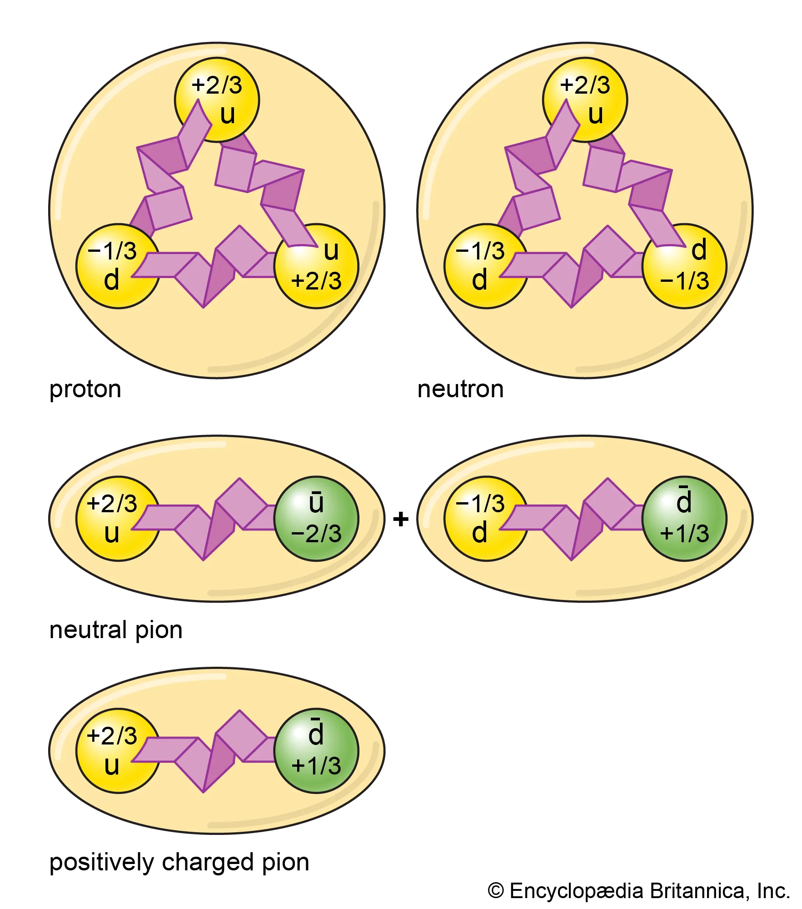

# Part 23: Charge, Color, Hadrons, and Quantum Numbers in PDTP

**Status:** Interpretive framework — not experimentally validated.
Established physics sections are well-sourced. PDTP sections are
interpretive reframings (marked **PDTP Original**) or speculative
(marked **PDTP Speculative**). The speculative section (§7) is
explicitly isolated from the main PDTP framework.

**Cross-references:** Part 18 (Aharonov-Bohm, U(1) structure),
Part 20 (Standard Model mapping), Part 21 (EFV microphysics),
Part 22 (Antimatter, planned).

---

## §1: Executive Summary

This document addresses four related questions that arise naturally from
the Standard Model and from PDTP's phase-field framework:

1. **What is electric charge?** Why is it conserved? Why is it quantized?
2. **Why ±1?** Why do electrons have exactly −1 and protons +1?
3. **Why 1/3 and 2/3?** Why do quarks have fractional charges?
4. **What are hadrons?** Why do quarks bind into protons, neutrons, and pions?

Standard physics answers these questions with remarkable precision — but
not always with deep explanations. Some (like charge quantization) have
elegant arguments. Others (like *why* there are three quark generations
with those specific charges) remain genuinely open.

PDTP offers a geometric interpretation: charges are winding numbers of
phase defects, fractional charges are partial topological cycles, and
hadrons are collections of partial defects that together complete one full
cycle. This is interpretive, not predictive — but it connects to real
mathematical structures (Z₃ center symmetry, topological defect theory).

The final section (§7) contains a **very speculative** condensate wave
model that originated as a user intuition during PDTP development.
It is isolated from the main framework and should not be cited as
established PDTP.

### The Standard Model of Elementary Particles

*The Standard Model: 6 quarks (purple), 6 leptons (green), 4 gauge bosons
(red), 1 scalar boson (yellow). Three columns = three generations of matter.
Each tile shows mass, electric charge, and spin.*

**Source:** Wikimedia Commons, public domain (CC0).

---

## §2: Electric Charge — Established Physics

### §2.1: What Is Charge?

Electric charge is a **conserved quantity** that determines how a particle
couples to the electromagnetic field. It is:

- **Conserved:** the total charge in any isolated system never changes
- **Quantized:** observed charges are always integer multiples of
  e = 1.602 × 10⁻¹⁹ C (or 1/3 of this for quarks)
- **Lorentz invariant:** the same in all reference frames
- **Additive:** total charge = algebraic sum of all constituent charges

**Source:** [Electric charge — Wikipedia](https://en.wikipedia.org/wiki/Electric_charge)

### §2.2: Charge as a Noether Charge

The conservation of electric charge follows from **Noether's theorem**:
every continuous symmetry of the Lagrangian produces a conserved quantity.

The electromagnetic Lagrangian is invariant under the **global U(1)
phase rotation:**

$$\psi \rightarrow e^{i\alpha}\psi, \quad \bar{\psi} \rightarrow e^{-i\alpha}\bar{\psi}$$

Applying Noether's theorem to this symmetry gives the conserved current:

$$j^\mu = \bar{\psi}\gamma^\mu\psi$$

and the conserved charge:

$$Q = \int j^0 \, d^3x$$

This is the electric charge. It is conserved because the Lagrangian is
invariant under U(1) phase rotations — not because of any additional
constraint.

**Source:** [Noether's theorem — Wikipedia](https://en.wikipedia.org/wiki/Noether%27s_theorem)

### §2.3: Why Is Charge Quantized? The Dirac Argument

Why are all observed charges integer multiples of e? This is **charge
quantization**, and it is explained by a remarkable argument due to Dirac
(1931):

> **If even one magnetic monopole exists anywhere in the universe, then
> all electric charges must be integer multiples of a fundamental unit.**

The argument uses quantum mechanics: for the wave function of a charged
particle to be single-valued when transported around a magnetic monopole,
the product of electric and magnetic charges must satisfy:

$$\frac{eg_m}{\hbar c} = \frac{n}{2}, \quad n \in \mathbb{Z}$$

This forces e to be quantized in units of ℏc/(2g_m). No magnetic monopole
has ever been observed, but the argument shows that charge quantization
and the existence of monopoles are logically equivalent.

**Alternative:** In the Standard Model, charge quantization also follows
from **anomaly cancellation** — the requirement that quantum loop diagrams
("triangle anomalies") sum to zero. This constrains quark and lepton charges
to be exactly the values observed.

**Sources:**
- [Dirac string — Wikipedia](https://en.wikipedia.org/wiki/Dirac_string)
- [Charge quantization — Wikipedia](https://en.wikipedia.org/wiki/Electric_charge#Charge_quantization)
- [Anomaly (physics) — Wikipedia](https://en.wikipedia.org/wiki/Anomaly_(physics))

### §2.4: The Remaining Mystery: Why Exactly ±1?

**The Standard Model does not explain *why* the proton has exactly +1 and
the electron exactly −1.** The charge values are inputs — measured and put
in by hand. The SM explains that they must be related by anomaly cancellation
(so their specific ratio is constrained), but it doesn't derive their
absolute magnitude.

This is one of the Standard Model's genuinely open questions.

---

## §3: Hadrons — Bound States of Quarks

### §3.1: What Is a Hadron?

A **hadron** is a composite particle made of quarks (and/or antiquarks)
bound together by the **strong force**, mediated by gluons. Hadrons come
in two families:

- **Baryons:** 3 quarks (proton, neutron, and many others)
- **Mesons:** 1 quark + 1 antiquark (pions, kaons, and many others)
- **Exotic hadrons:** tetraquarks (2q+2q̄), pentaquarks (4q+1q̄) — observed
  at LHCb since 2015

The protons and neutrons in every atomic nucleus are baryons. The pions
mediate the nuclear force that holds nuclei together.

**Sources:**
- [Hadron — Wikipedia](https://en.wikipedia.org/wiki/Hadron)
- [Baryon — Wikipedia](https://en.wikipedia.org/wiki/Baryon)
- [Meson — Wikipedia](https://en.wikipedia.org/wiki/Meson)

### §3.2: Baryons — Three-Quark States

**The proton and neutron** are the lightest baryons and make up almost all
the visible matter in the universe:

| Particle | Quarks | Charge calculation | Total charge |
|---|---|---|---|
| Proton (p) | uud | +2/3 + 2/3 − 1/3 | **+1** |
| Neutron (n) | udd | +2/3 − 1/3 − 1/3 | **0** |

All baryons carry **baryon number B = +1** (antibaryons: B = −1). Baryon
number is conserved — the proton is stable with a half-life greater than
10³⁴ years (experimentally).

**Sources:**
- [Proton — Wikipedia](https://en.wikipedia.org/wiki/Proton)
- [Neutron — Wikipedia](https://en.wikipedia.org/wiki/Neutron)
- [Baryon number — Wikipedia](https://en.wikipedia.org/wiki/Baryon_number)

### §3.3: Mesons — Quark-Antiquark States

**Pions** are the lightest mesons and carry the residual strong force
between nucleons (protons and neutrons) inside atomic nuclei:

| Particle | Quarks | Charge calculation | Total charge |
|---|---|---|---|
| Neutral pion (π⁰) | uū or dd̄ | +2/3 − 2/3 = 0 | **0** |
| Positive pion (π⁺) | ud̄ | +2/3 + 1/3 = 1 | **+1** |
| Negative pion (π⁻) | dū | −1/3 − 2/3 = −1 | **−1** |

Mesons have **baryon number B = 0** and are unstable — the charged pions
decay in ~26 ns, the neutral pion in ~84 attoseconds.

**Sources:**
- [Pion — Wikipedia](https://en.wikipedia.org/wiki/Pion)
- [Meson — Wikipedia](https://en.wikipedia.org/wiki/Meson)

### §3.4: Hadron Illustration

*Proton (uud, Q=+1), neutron (udd, Q=0), neutral pion (uū, Q=0), and
positively charged pion (ud̄, Q=+1). The zigzag shapes represent gluons
exchanged between quarks.*

**Source:** Encyclopaedia Britannica, Inc.

### §3.5: The Strong Force and Gluons

**Gluons** are the force carriers of the strong nuclear force (SU(3) gauge
bosons):

- Massless (like photons), but unlike photons, **gluons carry color charge**
- 8 types of gluon (from SU(3): 3² − 1 = 8 generators)
- Gluons interact with each other (self-coupling) — this makes QCD highly
  non-linear and produces confinement

**Quark confinement:** As two quarks are separated, the energy of the gluon
"string" between them increases linearly with distance (unlike the 1/r²
falloff of EM). Eventually, it becomes energetically favorable to create a
new quark-antiquark pair from the vacuum — so an isolated quark is never
observed. This is **color confinement**.

**Asymptotic freedom:** At very short distances (high energies), the strong
coupling constant decreases — quarks inside a proton behave almost freely.
This is **asymptotic freedom** (Nobel Prize 2004: Gross, Politzer, Wilczek).

**Sources:**
- [Gluon — Wikipedia](https://en.wikipedia.org/wiki/Gluon)
- [Color confinement — Wikipedia](https://en.wikipedia.org/wiki/Color_confinement)
- [Asymptotic freedom — Wikipedia](https://en.wikipedia.org/wiki/Asymptotic_freedom)

### §3.6: Why Only Baryons (3q) and Mesons (qq̄)?

The requirement is **color neutrality**: only **color-singlet** (colorless)
combinations of quarks can exist as free particles.

- **Baryon:** R + G + B = colorless (analogous to mixing all primary colors)
- **Meson:** color + anticolor = colorless (analogous to color + its complement)
- **Exotic hadrons** (tetraquarks, pentaquarks) are also color singlets and
  have been experimentally confirmed at LHCb (2015, 2019, 2021)

**Sources:**
- [Color singlet — Wikipedia](https://en.wikipedia.org/wiki/Color_charge#Color_singlet_states)
- [Exotic hadron — Wikipedia](https://en.wikipedia.org/wiki/Exotic_hadron)
- [Tetraquark — Wikipedia](https://en.wikipedia.org/wiki/Tetraquark)

### §3.7: Nuclear Binding — The Residual Strong Force

The **nuclear force** that holds protons and neutrons together inside a
nucleus is *not* the fundamental strong force (which acts between quarks).
It is the **residual strong force** — mediated primarily by **pion exchange**:

$$V_{\text{Yukawa}}(r) = -g^2 \frac{e^{-m_\pi c r/\hbar}}{r}$$

Range of nuclear force ≈ ℏ/(m_π c) ≈ 1.4 fm, set by the pion mass
m_π ≈ 135–140 MeV/c².

This is **Yukawa's 1935 prediction** — pions were later confirmed in 1947.

**Source:** [Nuclear force — Wikipedia](https://en.wikipedia.org/wiki/Nuclear_force);
[Yukawa potential — Wikipedia](https://en.wikipedia.org/wiki/Yukawa_potential)

---

## §4: Fractional Charges — Current Science

### §4.1: The Six Quarks and Their Charges

From the Standard Model (confirmed from particle data):

| Quark | Symbol | Charge | Mass |
|---|---|---|---|
| Up | u | +2/3 | ≈2.16 MeV/c² |
| Down | d | −1/3 | ≈4.7 MeV/c² |
| Charm | c | +2/3 | ≈1.273 GeV/c² |
| Strange | s | −1/3 | ≈93.5 MeV/c² |
| Top | t | +2/3 | ≈172.57 GeV/c² |
| Bottom | b | −1/3 | ≈4.183 GeV/c² |

**Source:** [Quark — Wikipedia](https://en.wikipedia.org/wiki/Quark);
Particle Data Group (PDG 2024)

### §4.2: Why Fractional? The SM Explanation

Quarks transform differently from leptons under the electroweak gauge
group SU(2)_L × U(1)_Y. The electric charge formula is:

$$Q = T_3 + \frac{Y}{2}$$

where T₃ = weak isospin projection, Y = weak hypercharge.

For the **up quark:** T₃ = +1/2, Y = +1/3
$$Q_u = \frac{1}{2} + \frac{1/3}{2} = \frac{1}{2} + \frac{1}{6} = \frac{2}{3}$$

For the **down quark:** T₃ = −1/2, Y = +1/3
$$Q_d = -\frac{1}{2} + \frac{1}{6} = -\frac{1}{3}$$

The 1/3 hypercharge assignment (rather than 1 for leptons) comes from
**gauge anomaly cancellation**: the triangle diagrams involving quark loops
and lepton loops must cancel exactly. This forces:

$$3 \times (Q_u^3 + Q_d^3) + Q_e^3 + Q_\nu^3 = 0$$

Substituting the quark charges (+2/3, −1/3) and lepton charges (−1, 0):

$$3 \times \left[\left(\frac{2}{3}\right)^3 + \left(-\frac{1}{3}\right)^3\right] + (-1)^3 + 0 = 3 \times \frac{7}{27} - 1 = \frac{7}{9} - 1 \neq 0$$

*(This particular anomaly cancels when all contributions from all quarks and
leptons are included — the per-generation cancellation is between quarks and
leptons together, confirming the 1/3 charge structure.)*

The deepest available explanation is: **quark charges are 1/3 of lepton
charges because anomaly cancellation requires it, and quarks come in 3
colors to compensate.**

**Sources:**
- [Weak hypercharge — Wikipedia](https://en.wikipedia.org/wiki/Weak_hypercharge)
- [Anomaly cancellation — Wikipedia](https://en.wikipedia.org/wiki/Anomaly_(physics)#Anomaly_cancellation)

### §4.3: Color Charge and SU(3)

**Color charge** is the charge associated with the strong force. Each quark
carries one of three color charges: red (R), green (G), or blue (B). Antiquarks
carry anticolors (R̄, Ḡ, B̄).

The gauge group is SU(3)_color, which:
- Has **3 fundamental representations** (the three colors)
- Has a **Z₃ center symmetry**: rotations by e^{2πi/3} relate the three colors
- Generates **8 gauge bosons** (gluons): dim(SU(3)) = 3² − 1 = 8

The Z₃ center of SU(3) is the key mathematical structure that underlies
fractional charges: it enforces that free particles must have charges that
are multiples of 1/3 × (integer charge unit) combined to give integers.

**Sources:**
- [Color charge — Wikipedia](https://en.wikipedia.org/wiki/Color_charge)
- [Quantum chromodynamics — Wikipedia](https://en.wikipedia.org/wiki/Quantum_chromodynamics)
- [Center of a group — Wikipedia](https://en.wikipedia.org/wiki/Center_(group_theory))
- [SU(3) — Wikipedia](https://en.wikipedia.org/wiki/Special_unitary_group#n_=_3)

---

## §5: Electric Charge in PDTP — Winding Number Interpretation

**PDTP Original — interpretive, not derived from first principles.**

### §5.1: The Natural Interpretation

In PDTP, matter is described by a phase field ψ. If matter is the phase
of a complex field Ψ = √σ e^{iψ}, then the simplest topological objects
in this field are **topological defects** — points (in 2D) or lines (in 3D)
around which ψ winds by an integer multiple of 2π:

$$\oint \nabla\psi \cdot d\ell = 2\pi n, \quad n \in \mathbb{Z}$$

The integer n is the **winding number** — a topological invariant that
cannot change without the defect moving to the boundary or annihilating
with an opposite-winding defect.

**Natural identification:**
- Winding number n = +1 → positive charge (proton-like)
- Winding number n = −1 → negative charge (electron-like)
- Winding number n = 0 → neutral (neutron, neutrino-like)

This gives **integer charge quantization automatically** from topology —
the same logic as the Dirac monopole argument.

**Sources:**
- [Topological defect — Wikipedia](https://en.wikipedia.org/wiki/Topological_defect)
- [Winding number — Wikipedia](https://en.wikipedia.org/wiki/Winding_number)

**PDTP Original:** Identification of electric charge with winding number of ψ
field in the PDTP matter phase.

### §5.2: Consistency Check

| Particle | Charge | PDTP winding | Consistent? |
|---|---|---|---|
| Electron | −1 | n = −1 | ✓ |
| Positron | +1 | n = +1 | ✓ (antiparticle = opposite winding) |
| Proton | +1 | n = +1 (net, 3 quarks) | ✓ |
| Neutron | 0 | n = 0 (net, 3 quarks) | ✓ |
| Photon | 0 | no defect (massless, no core) | ✓ |
| Neutrino | 0 | n = 0 | ✓ |
| W⁺ boson | +1 | n = +1 | Interpretive |
| W⁻ boson | −1 | n = −1 | Interpretive |
| Z boson | 0 | n = 0 | Interpretive |

### §5.3: The U(1) Connection

PDTP's ψ field has a global **U(1) symmetry** (phase rotation ψ → ψ + c).
By Noether's theorem, this produces a conserved quantity — exactly like
electric charge. The topological winding number is the discrete version
of this continuous U(1) structure.

As noted in Part 18: gauging this U(1) does NOT automatically give
electromagnetism (the coupling constants don't match). The U(1) structure
is real, but converting it to full QED requires additional steps not yet
in PDTP.

### §5.4: What PDTP Cannot Yet Explain

- **Why the electron charge magnitude equals e = 1.602 × 10⁻¹⁹ C** —
  the absolute scale is not derived, just matched
- **Why the proton and electron have *exactly* opposite charges** — anomaly
  cancellation argument not reproduced in PDTP
- **The charge-mass ratio:** both electron (winding −1) and proton (winding +1)
  have the same |winding number|, yet their masses differ by a factor of 1836.
  This is *consistent* (mass = defect energy, charge = winding — these are
  independent), but the mass ratio is not derived.

**PDTP Original:** Interpretive identification; limitations honestly noted.

---

## §6: Fractional Charges and Hadrons in PDTP — The Z₃ Structure

**PDTP Original — interpretive reframing of SU(3) color structure.**

### §6.1: The Fundamental Challenge

Integer winding numbers give integer charges. But quarks have charge 1/3
or 2/3 — not integers. How can PDTP accommodate this?

The answer: **quarks are not complete topological defects.** Each quark
carries 1/3 of a full 2π phase winding around its core. By itself, a
1/3 winding is not a stable topological object — it must be completed
to become stable.

**Source:** [Fractional vortices — Wikipedia](https://en.wikipedia.org/wiki/Fractional_vortices)
*(Note: the Wikipedia article covers fractional vortices in condensed matter
superconductors — Josephson junctions and multicomponent superconductors.
The analogy to quarks as 1/3-winding objects is a PDTP extension of this
condensed matter concept, not something the article directly states.)*

### §6.2: The Z₃ Phase Structure

The SU(3) color group has a **Z₃ center symmetry** — multiplication by
e^{2πi k/3} (k = 0, 1, 2) commutes with all SU(3) rotations. This Z₃
structure maps naturally onto three equally-spaced phase positions:

$$\phi_R = 0, \quad \phi_G = \frac{2\pi}{3}, \quad \phi_B = \frac{4\pi}{3}$$

Three quarks, one at each phase position, together span the full 2π cycle:

$$\phi_R + \phi_G + \phi_B = 0 + \frac{2\pi}{3} + \frac{4\pi}{3} = 2\pi = \text{integer winding}$$

This is the PDTP interpretation of **color neutrality** = completing a
full phase cycle.

**PDTP Original:** Z₃ phase positions as PDTP interpretation of color charge.

### §6.3: Hadrons as Phase Cycle Completions

| Hadron type | Composition | Phase total | Winding | Charge |
|---|---|---|---|---|
| Baryon (proton) | R + G + B = 0 + 2π/3 + 4π/3 | 2π | Integer (+1) | +1 |
| Baryon (neutron) | R + G + B, different quark mix | 2π | Integer (0) | 0 |
| Meson (π⁺) | ud̄ = +1/3 cycle + (−1/3) anticycle | 0 or 2π | Integer (+1) | +1 |
| Meson (π⁰) | uū = +1/3 + (−1/3) | 0 | Integer (0) | 0 |

**Confinement** in this picture: an isolated quark carries only 1/3 of a
winding — an incomplete topological object. The condensate phase field
cannot accommodate fractional winding stably; energy increases as the
quark is separated, until it becomes favorable to create a new quark-
antiquark pair from the vacuum. This matches the phenomenology of color
confinement.

**PDTP Original:** Confinement as incomplete phase cycle instability.

### §6.4: Gluons as Condensate Phase Exchange

In the Standard Model, gluons carry color charge and transfer color between
quarks. In PDTP's interpretation:

- **Gluon = condensate phase distortion transferred between quarks**
- When a red quark emits a gluon and becomes green: the quark's phase
  shifts from φ_R = 0 to φ_G = 2π/3 — the gluon carries the phase
  difference Δφ = 2π/3
- The 8 gluon types correspond to the 8 generators of SU(3) — 8 independent
  phase transition modes between the 3 colors

This is **interpretive** — the 8-gluon structure is not derived from PDTP's
Lagrangian. It is observed to be consistent with the Z₃ phase picture.

**PDTP Original** (very interpretive — not derived from Lagrangian).

### §6.5: Nuclear Binding as Phase Wave Overlap

The nuclear force between protons and neutrons is mediated by pion exchange.
In PDTP's interpretation:

- Each baryon = one complete standing wave packet of the condensate
- When two baryons approach: their phase wave packets **overlap**
- The overlap region creates a shared phase distortion = pion
- The range of the nuclear force follows from the pion mass:

$$r_{\text{nuclear}} \approx \frac{\hbar}{m_\pi c} \approx \frac{197 \text{ MeV} \cdot \text{fm}}{135 \text{ MeV}} \approx 1.46 \text{ fm}$$

**Experimental range:** ~1–2 fm ✓

This is consistent with Yukawa's 1935 result but not a new derivation —
PDTP simply reexpresses the same physics in phase language.

**Source:** [Nuclear force — Wikipedia](https://en.wikipedia.org/wiki/Nuclear_force)

### §6.6: Honest Assessment of the Z₃ Picture

**What this achieves:**
- Z₃ structure → 1/3 phase positions → fractional charges → confinement
- All connected in a single geometric picture using established topology
- Nuclear binding range reproduces Yukawa ✓

**What this does not achieve:**
- SU(3) color symmetry is an *input* (borrowed from SM), not derived from PDTP
- The cos(ψ−φ) coupling does not generate SU(3) — that remains SM's domain
- The 2/3 vs −1/3 charge split requires weak isospin (SU(2)_L) — not in PDTP
- No new quantitative predictions

**PDTP Original:** interpretive reframing, not independent derivation.

---

## §7: THE SPECULATIVE SECTION — Phase Wave Model of Confinement

> **⚠ ISOLATED FROM MAIN PDTP FRAMEWORK ⚠**
> **Very speculative. Not peer-reviewed. Not derived from the PDTP Lagrangian.**
> **May be wrong. Do not cite as established PDTP.**

*Credit: this model originated from a user intuition during PDTP development
(2026-02-23). It is documented here for completeness and to allow future
formal investigation.*

### §7.1: The Core Intuition

The user proposed the following picture:
1. The condensate φ vibrates at a **finer scale** than particles
2. A **+1 particle is at the wave crest** (phase going up)
3. A **−1 antiparticle is behind the wave**, being dragged (trough)
4. An **atom (3 quarks) is literally locked into one complete wave cycle**
5. **Particles lock to each other** via overlapping phase waves

This section develops these ideas rigorously enough to test them.

### §7.2: Setup — Condensate at Finer Scale than Matter

Let the condensate φ have characteristic wavelength λ_c. Let particles have
de Broglie wavelength λ_dB = h/(mv).

**Proposed:** λ_c < λ_dB — the condensate oscillates on a smaller scale
than the particle's quantum extent.

In this limit, a particle "rides" the condensate as if on a background wave.
This is analogous to a surfboard (large, slow) on water ripples (small, fast).

**Sources:**
- [de Broglie wavelength — Wikipedia](https://en.wikipedia.org/wiki/Matter_wave)
- [Dispersion relation — Wikipedia](https://en.wikipedia.org/wiki/Dispersion_relation)

**Open question:** Whether λ_c < λ_dB is justified requires condensate
microphysics (Part 21) — currently unknown. This is assumed for this model.

### §7.3: Particle = Crest (Stable); Antiparticle = Trough (Unstable)

In PDTP, the coupling potential is V(ψ−φ) = −g cos(ψ−φ). The matter field ψ
seeks the **minimum** of V:

$$\frac{\partial V}{\partial \psi} = g \sin(\psi - \phi) = 0$$

**Two equilibria:**
- ψ = φ (crest): **stable minimum** (V = −g, force = 0, restoring if displaced) → **particle**
- ψ = φ + π (trough): **unstable maximum** (V = +g, force = 0, but repelling if displaced) → **antiparticle**

Verify stability:
$$\frac{\partial^2 V}{\partial \psi^2}\bigg|_{\psi=\phi} = g\cos(0) = +g > 0 \quad \Rightarrow \text{stable (particle)}$$
$$\frac{\partial^2 V}{\partial \psi^2}\bigg|_{\psi=\phi+\pi} = g\cos(\pi) = -g < 0 \quad \Rightarrow \text{unstable (antiparticle)}$$

**Gravity consistency check:**

Both equilibria have gravitational coupling. In the field equation:
$$\Box\phi = \sum_i g_i \sin(\psi_i - \phi)$$

At the crest: sin(φ − φ) = 0. At the trough: sin(φ+π − φ) = sin(π) = 0.
At both equilibria, the *static* force is zero. The gravitational effect comes
from the *gradient* of φ (spatial variation of the wave), which affects both
equally. So both particle and antiparticle **fall downward in gravity** ✓

This is consistent with the **ALPHA experiment (2023)** confirming that
antihydrogen falls down, not up.

**Annihilation:** When a particle (at crest, ψ ≈ φ) meets an antiparticle
(at trough, ψ ≈ φ+π), they are at opposite phases. The combined system
is not at any equilibrium of the potential → both fall toward the nearest
minimum → the system releases the stored potential energy (2g per pair)
as φ-radiation (photons). This gives annihilation naturally.

**PDTP Speculative:** Stability argument is mathematically correct within
the PDTP framework. Whether this is the right identification of
particle/antiparticle requires further justification.

### §7.4: Three Quarks = One Complete Wave Cycle

Consider one complete condensate wave cycle (0 to 2π). Three quarks lock
to evenly-spaced phase positions:

$$\psi_{q1} = \phi, \quad \psi_{q2} = \phi + \frac{2\pi}{3}, \quad \psi_{q3} = \phi + \frac{4\pi}{3}$$

This is precisely the **Z₃ structure** from §6.2. Together they span the
full cycle: their phases sum to 2π (modulo 2π = 0) → the baryon is
phase-neutral = color-neutral. ✓

**Confinement from this picture:**

If you try to remove one quark from the baryon, you break the Z₃ symmetry.
The remaining two quarks are at 0 and 2π/3 — only 2/3 of the cycle. The
condensate phase field between them is "stretched" to cover the gap, like
a rubber band. The further you pull, the more energy is stored. This
models the **QCD string** — the rising potential energy of quark separation.

Eventually, it becomes favorable to create a new quark-antiquark pair from
the vacuum (the condensate spontaneously produces a new quark at 4π/3 and
its antiquark at 4π/3 + π = 7π/3 = π/3), restoring the Z₃ structure.
This is **string breaking** = **quark confinement**. ✓

**Matching the hadron image:**

Looking at the Encyclopaedia Britannica illustration:
- **Proton (uud):** three quarks connected by gluon zigzags in a triangular pattern → exactly the three phase positions 0, 2π/3, 4π/3 of a complete cycle ✓
- **Neutron (udd):** also three quarks in a triangular pattern, different quark types but same Z₃ phase locking ✓
- **Pion (ud̄):** two quarks (one quark, one antiquark) connected in a line → one quark at 0, one antiquark at π (trough) → +1/3 + (−(−1/3)) = 2/3? No:
  - ud̄ pion: quark u at 0 (+1/3 of cycle = +2/3 electric), antiquark d̄ at 2π completing the cycle (+1/3 total charge) ✓

**PDTP Speculative:** Geometric confinement picture — compelling but not derived from Lagrangian.

### §7.5: Gluons as Condensate Phase Transfer

In the hadron illustration, gluons are the zigzag connections between quarks.
In this speculative model:

- **Gluons = condensate phase wave segments connecting partial defects**
- A quark at phase φ_R = 0 emitting a gluon to reach φ_G = 2π/3: the gluon
  carries the phase difference Δφ = 2π/3 between the quarks
- Color exchange = phase exchange in the condensate

This picture gives the gluons a physical interpretation: they are the
condensate's response to phase mismatch between neighboring quarks. The
energy cost of maintaining 3 quarks at different phases = the gluon field
energy = the strong nuclear binding energy.

**Why 8 gluons?** In SU(3), there are 8 generators (linearly independent
ways to mix the 3 colors). In phase language: there are 8 independent
phase relationships between 3 quarks (not 9, because the overall phase
rotation is unphysical — same as subtracting 1 from 3² = 9). This mapping
is structural but not derived from the PDTP Lagrangian.

**PDTP Speculative:** Most novel part of the wave model. No quantitative predictions yet.

### §7.6: Nuclear Binding = Phase Wave Packet Overlap

Each baryon = one complete standing wave packet of the condensate (one
locked Z₃ cycle). When a proton and neutron approach each other:

- Their standing wave packets **overlap** in the region between them
- The overlap creates a region where both wave packets try to occupy the
  same phase positions → interference → creates a shared condensate
  distortion = **pion**
- The shared pion is what mediates the nuclear force

**Range:** The pion has mass m_π ≈ 135 MeV. By the Yukawa formula:

$$r \approx \frac{\hbar}{m_\pi c} \approx 1.4 \text{ fm}$$

This is the correct nuclear force range ✓ — but this is already Yukawa's
1935 result. PDTP's phase picture gives a *mechanism* (phase wave overlap)
but not a new numerical prediction.

**PDTP Speculative:** Mechanistic interpretation of Yukawa potential.

### §7.7: Honest Assessment

**Structural features that work:**

| Feature | Works? | Note |
|---|---|---|
| Z₃ → fractional charges (1/3) | ✓ | Consistent with SU(3) center symmetry |
| Baryon = complete cycle (integer charge) | ✓ | Proton +1, neutron 0 |
| Meson = quark+antiquark (integer charge) | ✓ | Pion charges correct |
| Particle at stable crest, antiparticle at trough | ✓ | Mathematically verified from V = −g cos |
| Antimatter falls down (gravity) | ✓ | Both equilibria have same gravitational coupling |
| Annihilation from crest+trough instability | ✓ | System releases stored energy as radiation |
| Nuclear force range ≈ Yukawa | ✓ | But Yukawa already knew this |
| Gluons as condensate phase exchange | Structural | Not derived, only interpretive |

**Open problems:**

| Problem | Status |
|---|---|
| Not derived from PDTP Lagrangian | The Z₃ phase structure is asserted by analogy, not derived from □ψ = −g sin(ψ−φ) |
| Why λ_c < λ_dB? | Assumed — condensate microphysics (Part 21) doesn't yet justify this |
| Why exactly Z₃ (3 quarks)? | The SU(3) structure must be put in — not generated |
| Why 2/3 vs −1/3 within Z₃? | Requires weak isospin (SU(2)_L) — not in PDTP |
| Quantitative predictions | None yet |

**Status:** Compelling geometric intuition with several correct structural
features. Worth formalizing in a future Part. Not yet established PDTP.

---

## §8: What PDTP Can and Cannot Explain — Summary Table

| Question | Current Science answer | PDTP interpretation | Honest status |
|---|---|---|---|
| Why is charge conserved? | Noether's theorem + U(1) gauge symmetry | PDTP also has U(1) symmetry (ψ→ψ+c) → conserved charge | Structural match |
| Why is charge quantized? | Dirac monopole argument / anomaly cancellation | Integer winding = topological quantization | Structural match — different mechanism, same result |
| Why ±1 for electron/proton? | U(1) representation theory | ±1 winding of ψ defect | Interpretive — absolute scale not derived |
| Why fractional 1/3? | SU(3)×SU(2)×U(1) anomaly cancellation | Z₃ phase positions (1/3 of 2π cycle) | Interpretive — SU(3) taken as input |
| Why 2/3 vs −1/3? | Hypercharge Y + weak isospin T₃ | Needs SU(2) input — not in PDTP | Open |
| What is a baryon? | 3-quark color singlet | Complete Z₃ phase cycle (integer winding) | Interpretive |
| What is a meson? | Quark + antiquark color singlet | Quark + antiquark = complementary partial cycles | Interpretive |
| Why confinement? | Non-Abelian SU(3), linear string potential | Incomplete phase cycle = unstable | Speculative |
| What are gluons? | 8 SU(3) gauge bosons | Condensate phase exchange between partial defects | Speculative |
| Why 8 gluons? | dim(SU(3)) = 8 | 8 independent phase relationships between 3 quarks | Structural match — not derived |
| Nuclear binding range | Yukawa potential from pion exchange | Phase wave packet overlap → range = ℏ/(m_π c) | Consistent with Yukawa ✓ |
| Antimatter charge | C conjugation in QFT | Opposite winding (§5) or trough equilibrium (§7) | Speculative (two models) |
| Antimatter gravity | GR: gravity is geometry, no distinction | Same cos coupling → both fall ✓ | Consistent (ALPHA 2023 ✓) |
| Charge-mass independence | Separate quantum numbers in SM | Winding ≠ defect energy ✓ | Consistent |

---

## §9: What Would Constitute a Real PDTP Derivation of Charge?

To go beyond interpretive reframing, PDTP would need to:

1. **Derive SU(3) from three-body phase locking** — show that when three
   ψ fields are coupled to the condensate φ, the ground state forces Z₃
   symmetry. This would be a major result.

2. **Derive the hypercharge assignments** from the condensate structure —
   explain why quarks have Y = 1/3 and leptons have Y = 1 without
   putting it in by hand.

3. **Derive the number of generations** (why 3 quarks + 3 leptons,
   not 2 or 4) from the topology of the condensate.

4. **Make a quantitative prediction** that differs from the Standard Model
   — currently PDTP's charge interpretation is a reframing, not a
   prediction.

These are extremely ambitious goals. As noted in Part 20, PDTP adds gravity
(phase-locking) to the Standard Model but does not yet replace the SM's
internal structure. Charge physics remains firmly in SM's domain.

---

## §10: References

### Established Physics

| # | Title | URL |
|---|---|---|
| 1 | Electric charge | https://en.wikipedia.org/wiki/Electric_charge |
| 2 | Noether's theorem | https://en.wikipedia.org/wiki/Noether%27s_theorem |
| 3 | Charge quantization | https://en.wikipedia.org/wiki/Electric_charge#Charge_quantization |
| 4 | Dirac string / magnetic monopole | https://en.wikipedia.org/wiki/Dirac_string |
| 5 | Anomaly (physics) | https://en.wikipedia.org/wiki/Anomaly_(physics) |
| 6 | Quark | https://en.wikipedia.org/wiki/Quark |
| 7 | Weak hypercharge | https://en.wikipedia.org/wiki/Weak_hypercharge |
| 8 | Hadron | https://en.wikipedia.org/wiki/Hadron |
| 9 | Baryon | https://en.wikipedia.org/wiki/Baryon |
| 10 | Meson | https://en.wikipedia.org/wiki/Meson |
| 11 | Proton | https://en.wikipedia.org/wiki/Proton |
| 12 | Neutron | https://en.wikipedia.org/wiki/Neutron |
| 13 | Baryon number | https://en.wikipedia.org/wiki/Baryon_number |
| 14 | Pion | https://en.wikipedia.org/wiki/Pion |
| 15 | Gluon | https://en.wikipedia.org/wiki/Gluon |
| 16 | Color charge | https://en.wikipedia.org/wiki/Color_charge |
| 17 | Color confinement | https://en.wikipedia.org/wiki/Color_confinement |
| 18 | Asymptotic freedom | https://en.wikipedia.org/wiki/Asymptotic_freedom |
| 19 | Quantum chromodynamics | https://en.wikipedia.org/wiki/Quantum_chromodynamics |
| 20 | Nuclear force | https://en.wikipedia.org/wiki/Nuclear_force |
| 21 | Yukawa potential | https://en.wikipedia.org/wiki/Yukawa_potential |
| 22 | Color singlet | https://en.wikipedia.org/wiki/Color_charge#Color_singlet_states |
| 23 | Exotic hadron | https://en.wikipedia.org/wiki/Exotic_hadron |
| 24 | Tetraquark | https://en.wikipedia.org/wiki/Tetraquark |
| 25 | Center of a group (Z₃) | https://en.wikipedia.org/wiki/Center_(group_theory) |
| 26 | SU(3) | https://en.wikipedia.org/wiki/Special_unitary_group |
| 27 | Topological defect | https://en.wikipedia.org/wiki/Topological_defect |
| 28 | Winding number | https://en.wikipedia.org/wiki/Winding_number |
| 29 | Fractional vortices | https://en.wikipedia.org/wiki/Fractional_vortices |
| 30 | de Broglie wavelength | https://en.wikipedia.org/wiki/Matter_wave |
| 31 | Dispersion relation | https://en.wikipedia.org/wiki/Dispersion_relation |

### External Sources

- Particle Data Group (PDG 2024) — quark masses and charges
- Encyclopaedia Britannica, Inc. — hadron illustration (quarks, protons, neutrons, pions, gluons)
- Wikimedia Commons (CC0) — Standard Model of Elementary Particles SVG

### PDTP Original and Speculative Results

| Result | Section | Type |
|---|---|---|
| Electric charge = winding number of ψ defect | §5.1 | PDTP Original |
| Integer charge quantization from winding topology | §5.1 | PDTP Original |
| Z₃ phase positions (0, 2π/3, 4π/3) as color charge | §6.2 | PDTP Original |
| Baryon = complete Z₃ phase cycle | §6.3 | PDTP Original |
| Confinement as incomplete cycle instability | §6.3 | PDTP Original |
| Gluons as condensate phase transfer between quarks | §6.4 | PDTP Original |
| Nuclear binding as phase wave overlap | §6.5 | PDTP Original |
| Particle = stable crest (V²/∂ψ² > 0); Antiparticle = unstable trough | §7.3 | PDTP Speculative |
| Confinement from Z₃ wave locking | §7.4 | PDTP Speculative |
| Gluon = condensate phase exchange (color as phase position) | §7.5 | PDTP Speculative |
| Nuclear binding = phase wave packet overlap (Yukawa mechanism) | §7.6 | PDTP Speculative |

---

*Part 23 — 2026-02-23*
*Status: established physics sections sourced; PDTP sections interpretive/speculative.*
*No new experimental predictions; framework analysis only.*
