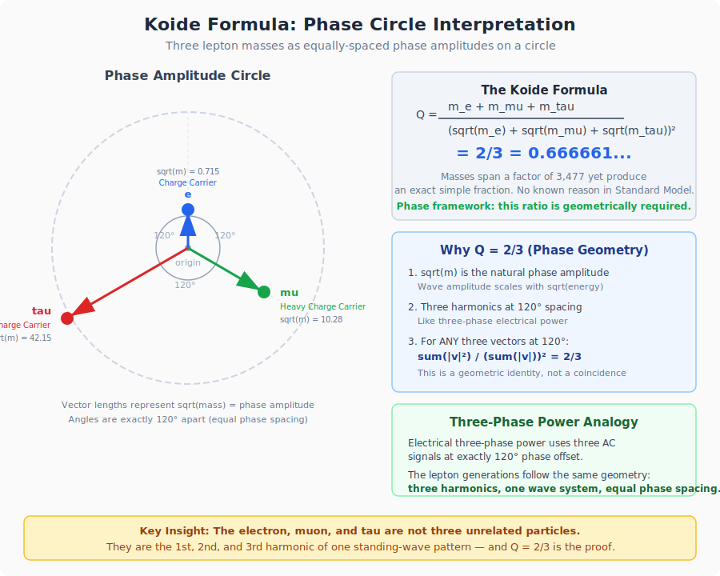

# Phase Framework Interpretations of Unsolved Physics Mysteries

This document applies the Phase-Decoupled Physics framework to major unsolved problems
in physics and cosmology. Each mystery is presented with the standard physics problem,
followed by how the phase-coupling framework reframes or addresses it.

All interpretations use the framework's core premise:

> Matter is standing waves. Spacetime is a wave-supporting medium.
> Gravity is phase-locking between matter-waves and spacetime-waves.

This document is speculative and conceptual. It does not claim experimental proof.

---

## Table of Contents

1. [Virtual Particles / Vacuum Fluctuations](#1-virtual-particles--vacuum-fluctuations)
2. [Antimatter Asymmetry (Baryogenesis)](#2-antimatter-asymmetry-baryogenesis)
3. [Dark Matter](#3-dark-matter)
4. [Dark Energy](#4-dark-energy)
5. [Black Hole Entropy](#5-black-hole-entropy)
6. [Hawking Radiation](#6-hawking-radiation)
7. [Precise Light Bending](#7-precise-light-bending)
8. [Cosmological Predictions (Expansion)](#8-cosmological-predictions-expansion)
9. [Experimental Testability of Quantum Gravity](#9-experimental-testability-of-quantum-gravity)
10. [The Cosmological Constant Problem](#10-the-cosmological-constant-problem)
11. [GR-QM Incompatibility](#11-gr-qm-incompatibility)
12. [The Equivalence Principle](#12-the-equivalence-principle)
13. [Cosmic Microwave Background Radiation](#13-cosmic-microwave-background-radiation)
14. [Black Hole Singularities](#14-black-hole-singularities)
15. [Quark Confinement](#15-quark-confinement)
16. [The Koide Formula](#16-the-koide-formula)
17. [Why Exactly Three Generations of Particles](#17-why-exactly-three-generations-of-particles)
18. [Quantum Entanglement](#18-quantum-entanglement)
19. [The Measurement Problem / Wave Function Collapse](#19-the-measurement-problem--wave-function-collapse)
20. [The Double-Slit Experiment](#20-the-double-slit-experiment)
21. [The Arrow of Time](#21-the-arrow-of-time)
22. [The Hierarchy Problem](#22-the-hierarchy-problem)
23. [Neutrino Oscillations](#23-neutrino-oscillations)
24. [The Strong CP Problem](#24-the-strong-cp-problem)
25. [The Fine-Structure Constant](#25-the-fine-structure-constant)
26. [Proton Stability](#26-proton-stability)
27. [High-Temperature Superconductivity](#27-high-temperature-superconductivity)
28. [Turbulence](#28-turbulence)
29. [The Nature of Time](#29-the-nature-of-time)
30. [Summary Table](#summary-table)

---

## 1. Virtual Particles / Vacuum Fluctuations

### The Standard Problem

In quantum field theory, the vacuum is not truly empty. The uncertainty principle allows
brief energy fluctuations that produce virtual particle-antiparticle pairs. These appear
spontaneously, exist for an incredibly short time, and annihilate each other. They cannot
be directly observed, but have measurable effects (the Casimir effect, Lamb shift).

The most dramatic version appears at black hole horizons (Hawking radiation), where a
virtual pair forms, one falls in, and the other escapes as real radiation.

### Phase Framework Interpretation

The framework rejects the "virtual particle storytelling" and replaces it with a
wave-based mechanism.

**Quantum fields as Excitation Substrates:**
The renamed vocabulary relabels quantum fields as Excitation Substrates (refined from
"Particle Generators") — continuous background wave systems that produce excitations.
Rather than spawning ghost-like virtual particles, the field is an oscillating medium
where transient wave patterns briefly form and dissolve.

**"Popping in and out" as brief phase coherence events:**
A virtual particle is an unstable, momentary standing wave — a brief flicker of phase
coherence in the background field that does not persist long enough to become "real"
matter. Nothing is created or destroyed — the medium fluctuates.

Analogy: the surface of a choppy ocean where wave peaks briefly form structures that
look like shapes, then collapse.

**The vacuum itself as a phase-active background:**
The glossary defines spacetime as a dynamic oscillatory medium. The "quantum foam" of
virtual particles becomes the baseline oscillation of spacetime's wave structure.
Fluctuations are the medium doing what wave media do: vibrating, with occasional
transient patterns.

---

## 2. Antimatter Asymmetry (Baryogenesis)

### The Standard Problem

The Big Bang should have produced equal amounts of matter and antimatter. They should
have annihilated completely, leaving only radiation. Yet the universe is full of matter.
This is called the matter-antimatter asymmetry problem.

### Phase Framework Interpretation

The framework calls antimatter **Mirror Matter** — matter with inverted phase properties.

- If matter is a standing wave with a specific phase orientation, then antimatter is the
  same standing wave with inverted phase
- Matter-antimatter annihilation is destructive wave interference — two opposite-phase
  waves canceling and releasing energy as radiation (Light Messengers)
- The asymmetry problem becomes: why did slightly more waves stabilize in one phase
  orientation than the other?
- In wave physics, this is a symmetry-breaking event. Just as a vibrating plate settles
  into one mode pattern based on tiny initial conditions, the early universe's wave
  medium could have had a slight phase bias favoring one orientation
- Phase-locking offers a mechanism: once a small majority of matter-waves locked to
  spacetime in one orientation, that orientation became self-reinforcing — new wave
  formations preferentially lock to the dominant phase pattern

---

## 3. Dark Matter

### The Standard Problem

Approximately 27% of the universe's mass-energy is invisible matter that does not
interact with light. Detected only through gravity — galaxy rotation curves, gravitational
lensing.

### Phase Framework Interpretation

Dark matter is **Phase-Coupled Structural Mass** — matter whose internal waves phase-lock
to spacetime but do not phase-lock to electromagnetic or nuclear interaction layers.

| Coupling Layer | Normal Matter | Dark Matter |
|----------------|---------------|-------------|
| Spacetime (gravity) | Locked | Locked |
| EM fields (light) | Locked | Not locked |
| Nuclear fields (atoms) | Locked | Not locked |

Dark matter:
- Has mass and curves spacetime (gravity works)
- Does not glow, absorb, reflect, or emit light
- Cannot form atoms, chemistry, or structures like stars
- Acts as gravitational scaffolding

Key insight: galaxies form inside pre-existing dark matter phase structures, not the
other way around. Dark matter is the skeleton; visible matter is the flesh.

It is not hiding. It simply does not participate in the electromagnetic phase-coupling
layer. Interaction is possible only through gravity (phase coupling to spacetime) and
large-scale spacetime geometry.

---

## 4. Dark Energy

### The Standard Problem

Approximately 68% of the universe's mass-energy is something accelerating the expansion
of space itself. It acts like a constant pressure pushing spacetime apart.

### Phase Framework Interpretation

Dark energy is **Spacetime Phase Drift** — a slow, uniform tendency for spacetime waves
to de-synchronize over distance.

> If gravity is phase-locking between matter-waves and spacetime-waves, then dark energy
> is gradual phase de-alignment within spacetime-waves themselves.

Effects:
- Spacetime stretches as internal phase coherence drifts
- Phase distances between locked systems increase
- At cosmic scales, drift dominates over local phase-locking

Why it does not tear atoms apart:

| Scale | Dominant Effect |
|-------|-----------------|
| Atoms, molecules | Strong internal phase-locking — unaffected |
| Solar systems | Gravity phase-lock dominates — unaffected |
| Galaxies | Weakly affected |
| Galaxy clusters | Strongly affected |
| Cosmic voids | Expansion dominates completely |

Dark energy is uniform because it is a baseline property of spacetime's phase behavior,
not a localized substance.

---

## 5. Black Hole Entropy

### The Standard Problem

Black hole entropy scales with surface area, not volume (Bekenstein-Hawking). This is
deeply counterintuitive and suggests hidden degrees of freedom on horizons. It drives
the holographic principle and remains unresolved.

### Phase Framework Interpretation

- The event horizon is a **phase-lock boundary** — the surface where spacetime phase
  gradients become so extreme that all internal phase freedom is crushed
- Entropy = loss of internal phase freedom due to extreme phase-locking compression
- Area scaling is natural because phase coupling occurs at the interface between
  matter-waves and spacetime-waves
- No interior free phase states remain once fully locked
- No need for holographic postulates as a patch; the area law is structural

Supporting evidence: Bekenstein-Hawking thermodynamics, AdS/CFT correspondence, and
analog black hole experiments all align with interface-based phase information.

---

## 6. Hawking Radiation

### The Standard Problem

Requires quantum field theory on curved spacetime. Particle-antiparticle creation at
the horizon is mathematically subtle and heavily coordinate-dependent.

### Phase Framework Interpretation

Hawking radiation is **phase de-locking leakage** at extreme gradients:

- Near the horizon, spacetime phase gradients exceed stable lock bandwidth
- Small decoherence events eject energy outward as radiation
- No need for virtual particle storytelling
- Radiation is a coherence failure mode, not spontaneous creation
- Radiation strength is predicted by phase gradient steepness

Supporting evidence: Analog black hole experiments (Steinhauer BEC experiments, water
tank horizons, optical fiber horizons) all produce Hawking-like radiation from
wave-locking breakdown, not gravity.

---

## 7. Precise Light Bending

### The Standard Problem

GR predicts light bending accurately, but requires special treatment for massless
particles (null geodesics). Conceptually awkward — why does a massless thing follow
curvature?

### Phase Framework Interpretation

- Light is already weakly phase-locked to spacetime
- It follows the same phase gradients as matter, with near-zero inertia coupling and
  high responsiveness to phase curvature
- Same mechanism for photons and matter — no special rules for "massless" objects
- Bending = phase steering

Supporting evidence: Metamaterial experiments where light bends via phase velocity
gradients reproduce the same math structure as GR geodesics.

---

## 8. Cosmological Predictions (Expansion)

### The Standard Problem

The expansion of the universe requires dark energy, fine-tuned constants, and inflation
as a patch. Why the universe expands, and at what rate, is unclear.

### Phase Framework Interpretation

- Expansion = global phase drift of spacetime-waves
- Dark energy is slow desynchronization between large-scale spacetime phase and
  matter-wave reference frequency
- Expansion rate is tied to phase coherence decay, not vacuum energy
- The Hubble Tension (different expansion rates from different measurements) becomes
  expected: it reflects local vs. global spacetime phase drift

Supporting evidence: Planck satellite CMB phase correlations, large-scale structure
surveys showing wave-like coherence patterns in galaxy clustering.

---

## 9. Experimental Testability of Quantum Gravity

### The Standard Problem

Quantum gravity effects appear only at the Planck scale (~10^-35 meters), completely
inaccessible to experiments.

### Phase Framework Interpretation

PDTP shifts tests from Planck scale to mesoscopic coherence scale:

- **Coherence vs. gravity:** Do ultra-coherent systems show anomalous inertial behavior?
- **Phase-noise coupling:** Does added phase noise slightly alter effective weight?
- **Precision interferometry:** Look for phase-gradient drift not predicted by GR
- **Decoherence thresholds:** Does gravity induce decoherence as coupling strength predicts?

Supporting evidence: Atom interferometry (Stanford, MIT) already measures gravity via
quantum phase shifts. Cold atom drop towers and superconducting systems probe related
territory.

---

## 10. The Cosmological Constant Problem

### The Standard Problem

Quantum field theory predicts vacuum energy density ~10^120 times larger than observed.
Sometimes called the worst prediction in physics.

### Phase Framework Interpretation

From the toy phase-coupling equation:

```
Box(phi) = Sum_i g_i sin(psi_i - phi)
```

- Spacetime reacts to phase mismatch, not absolute energy
- Rapid quantum vacuum fluctuations average out and do not strongly phase-lock to spacetime
- Vacuum energy produces large fluctuations but minimal net phase-lock stress
- Gravity never responded to raw energy density — only to phase synchronization stress
- The 10^120 discrepancy dissolves without fine-tuning

---

## 11. GR-QM Incompatibility

### The Standard Problem

General relativity is classical. Quantum mechanics is quantum. They do not combine into
a consistent theory.

### Phase Framework Interpretation

- The issue is conceptual, not merely mathematical
- Einstein's equations are an emergent, coarse-grained limit of deeper
  phase-synchronization dynamics
- At quantum level: individual matter-waves phase-lock to spacetime-waves
- At macro scale: the average of all locks produces smooth curvature (classical GR)
- The incompatibility exists because two descriptions of different scales are forced
  into one equation, when one is a limit of the other

---

## 12. The Equivalence Principle

### The Standard Problem

Inertial mass equals gravitational mass exactly. Standard physics offers no explanation
for why.

### Phase Framework Interpretation

Both arise from the same coupling parameter alpha:

- Gravity = how strongly matter-waves lock to spacetime-waves
- Inertia = how strongly matter-waves resist changes through spacetime-waves
- Same lock, same strength: `m_eff = alpha * m` applies to both
- The equivalence principle is a structural identity, not a coincidence or postulate

---

## 13. Cosmic Microwave Background Radiation

### The Standard Problem

Approximately 380,000 years after the Big Bang, the universe cooled enough for electrons to
bind to nuclei (recombination). Photons were released and have been stretching with
expansion ever since, now appearing as faint microwaves from every direction.

### Phase Framework Interpretation

**Before recombination — Phase Chaos:**
- The early universe was total phase incoherence — all matter-waves, spacetime-waves,
  and EM field waves violently coupled and constantly disrupting each other
- Light Messengers (photons) could not propagate freely — they continuously
  phase-scattered off free Charge Carriers (electrons)
- The EM phase layer was saturated with coupling — no clean phase gradient could form

**Recombination — The Great Phase-Lock:**
- As the universe cooled, Charge Carriers became phase-locked into atomic assemblies
  (bound to Positive Core Assemblies / protons)
- Once locked into atoms, electrons' phase states were no longer free targets for
  photon scattering
- The EM coupling layer cleared — Light Messengers could propagate along clean
  phase gradients
- This was a phase transition of the entire EM coupling layer

**The CMB itself — Fossil Phase Pattern:**
- The radiation is the last snapshot of the EM field's phase state at decoupling
- Tiny temperature variations (~1 part in 100,000) map to phase density variations
  in the spacetime-matter wave medium
- Hotter spots = stronger phase coupling (denser matter-wave concentrations)
- Cooler spots = weaker coupling (phase voids)
- These phase variations became seeds for all large-scale structure

**Redshift of the CMB:**
- Spacetime phase drift (dark energy) over 13.8 billion years has stretched the
  wavelength of the original Light Messengers
- The phase pattern is preserved but the carrier frequency has been dragged down
  by the expanding phase medium

The CMB is a fossil record of the universe's first major phase-locking event.

---

## 14. Black Hole Singularities

### The Standard Problem

GR predicts that at the center of a black hole, all mass collapses to an infinitely
dense, zero-volume point — a singularity. The math produces infinities (infinite density,
infinite curvature). Nobody believes the singularity is physically real, but GR offers
no way to avoid it.

### Phase Framework Interpretation

**Why GR produces a singularity:**
GR says spacetime curvature responds to energy density. More density = more curvature =
more compression = more density. This feedback loop has no brake.

**Why the phase framework does not:**
The toy coupling equation uses `sin(psi_i - phi)`, which is bounded. The sine function
maxes out at 1. As matter-waves compress and phase mismatch grows, coupling stress
saturates — it hits a ceiling. The runaway feedback loop cannot occur because the
driving term is bounded.

**What replaces the singularity — Maximum Phase-Lock State:**
- As matter falls inward, phase coupling stress increases
- At threshold, total phase-lock saturation is reached — every phase degree of freedom
  is locked
- No further compression is possible — no remaining free phase states to compress
- The result is not a zero-volume point but a finite-volume region of maximum
  phase density
- Like a crystal of perfectly synchronized waves — you cannot make it more synchronized
  than perfect

**The information paradox:**
- Information is phase state — the specific configuration of matter-wave phases
- At maximum phase-lock, all states are flattened to the boundary (the horizon)
- Information is not destroyed — it is phase-compressed onto the lock boundary
- This is exactly what Bekenstein-Hawking area-entropy already suggests
- Hawking radiation slowly releases that phase information as the gradient weakens

| GR View | Phase Framework View |
|---------|---------------------|
| Infinite density point | Maximum phase-lock saturation (finite) |
| Infinite curvature | Maximum phase gradient (bounded by sine) |
| Information destroyed | Phase information compressed to boundary |
| Math breaks down | Math saturates — bounded, not divergent |
| Singularity is physical | Singularity is an artifact of an unbounded theory |

---

## 15. Quark Confinement

### The Standard Problem

Quarks are never observed alone. They always appear in groups of three (baryons: protons,
neutrons) or two (mesons: quark + antiquark). Pulling a quark out invests energy that
creates new quark pairs instead. The strong force gets stronger with distance — opposite
of every other force. This is called confinement and is one of the Clay Millennium Prize
Problems.

### Phase Framework Interpretation

**Core Matter Bits as incomplete standing waves:**
- A single quark is not a stable standing wave — it is a partial wave pattern that cannot
  satisfy its own boundary conditions
- Like a vibration with only one end pinned — it cannot sustain itself
- Quarks need other quarks to form a closed, self-reinforcing wave structure

**Why three quarks, or a quark-antiquark pair?**

Each Core Matter Bit carries a phase orientation (color charge). A stable standing wave
assembly requires phase completeness — all orientations must sum to neutral:

- Three quarks with three different phase orientations (red + green + blue) create a
  phase-complete loop — a stable, self-contained wave pattern (the baryon)
- A quark + antiquark pair (color + anticolor) also sums to neutral (the meson)
- Any other combination is phase-incomplete and cannot form a stable standing wave

**Why the force strengthens with distance:**

- Inside a proton, the three Core Matter Bits are phase-locked via Binding Messengers
- At short range, wave patterns naturally overlap and reinforce — quarks act almost
  freely (asymptotic freedom)
- Separating them increases phase mismatch between bits and binding field
- Unlike EM gradients which spread and weaken (1/r^2), Core Binding phase gradient is
  confined to a narrow tube — it cannot disperse
- Pulling harder stretches the tube, concentrating more phase energy — coupling gets
  stiffer, not weaker
- When stored energy exceeds the threshold for new Core Matter Bit creation, the tube
  snaps and energy condenses into a new quark-antiquark pair
- Result: two bound assemblies instead of one free quark

**The guitar string analogy:**
- Guitar string (binding field) between two pegs (quarks)
- Gentle pluck: string vibrates freely (asymptotic freedom)
- Pull pegs apart: tension increases (confinement)
- Pull hard enough: string breaks, each broken end instantly forms a new peg (pair
  creation) — no free string end ever exists

| Property | Gravity | EM | Strong Force |
|----------|---------|-----|-------------|
| Phase gradient shape | Spreads freely | Spreads freely | Confined tube |
| Coupling at distance | Weakens (1/r^2) | Weakens (1/r^2) | Increases |
| Single-particle states | Allowed | Allowed | Forbidden |

---

## 16. The Koide Formula

### The Standard Problem

In 1981, Yoshio Koide discovered a numerical relationship between the masses of the
three charged leptons:

```
Q = (m_e + m_mu + m_tau) / (sqrt(m_e) + sqrt(m_mu) + sqrt(m_tau))^2 = 2/3
```

- Electron mass: 0.511 MeV
- Muon mass: 105.66 MeV
- Tau mass: 1776.86 MeV

The result is 0.666661... — within experimental error of exactly 2/3. The masses span
a factor of ~3,477. No known reason in the Standard Model explains this relation.

### Phase Framework Interpretation

**Three generations as harmonic modes:**

If matter is standing waves, then the electron, muon, and tau are not three unrelated
particles — they are three harmonic modes of the same fundamental wave pattern:

- Charge Carrier (electron) = fundamental mode — lowest energy, most stable
- Heavy Charge Carrier (muon) = second harmonic — higher energy, decays in ~2.2 microseconds
- Ultra-Heavy Charge Carrier (tau) = third harmonic — highest energy, decays in ~2.9 x 10^-13 seconds

In wave physics, harmonics are not arbitrary. Their frequencies (and therefore energies
and masses) are constrained by boundary conditions of the medium.

**Why Q = 2/3:**

The formula Q = 2/3 is the value obtained when three quantities are related as
equally-spaced phases on a circle:

- The square roots of the masses (sqrt(m)) represent phase amplitudes of three
  harmonic modes
- Those modes are equally spaced in phase angle around a common reference (120 degrees
  apart, like three-phase electrical power)
- The ratio of the sum of squares to the square of sums is geometrically constrained
  to 2/3



This is not a coincidence — it is a structural requirement. Three harmonics of the
same wave system, equally spaced in phase, must satisfy this relation.

**Why sqrt(m), not m?**

Mass arises from coupling to the Mass Environment (Higgs field). The amplitude of a
standing wave scales with sqrt(energy) and therefore sqrt(mass). So sqrt(m) is the
natural "phase amplitude" variable. The Koide formula is written in the framework's
native language.

**Predictions:**
- The three lepton generations are the only three stable harmonic modes permitted by
  the wave structure
- Similar relations should exist for quarks (extended Koide relations have been explored)
- A fourth generation would violate phase geometry constraints — consistent with
  experimental evidence that only three generations exist

---

## 17. Why Exactly Three Generations of Particles

### The Standard Problem

The Standard Model has three generations of matter (electron/muon/tau, up/charm/top,
down/strange/bottom, and their neutrinos). Why three? No explanation exists.

### Phase Framework Interpretation

This follows directly from the Koide analysis:

- If particles are standing-wave harmonics in a phase medium, the number of stable
  harmonics is set by dimensionality and boundary conditions
- We live in 3+1 dimensional spacetime
- A standing wave in a 3D phase medium supports three stable harmonic modes before
  the pattern becomes unstable
- The fourth harmonic would require more phase space than the medium provides — it
  would instantly decohere
- Three generations is a topological constraint of wave patterns in 3D space

Higher generations are heavier and less stable because each successive harmonic packs
more energy into a more complex phase pattern with more ways to lose coherence (decay).

---

## 18. Quantum Entanglement

### The Standard Problem

Two particles can be entangled such that measuring one instantly determines the state
of the other, regardless of distance. Einstein called it "spooky action at a distance."
Experimentally confirmed, but the mechanism remains philosophically troubling.

### Phase Framework Interpretation

Entanglement is **shared phase identity**:

- When two particles become entangled, their wave patterns become a single standing
  wave with two spatial nodes — not two separate waves that are correlated
- They share one phase state, not two synchronized states
- Measuring one node reveals information about the single shared wave
- Distance is irrelevant because the phase relationship is not mediated by a signal —
  the two particles never stopped being one wave

Analogy: Tearing a page in half and mailing each half to different cities. Opening one
envelope instantly tells you what is in the other. No signal traveled. But deeper — the
two halves remain dynamically one system, not just statically correlated.

No faster-than-light communication is possible because you cannot control which result
you get — only observe it. The shared phase state determines correlation but is not
steerable.

---

## 19. The Measurement Problem / Wave Function Collapse

### The Standard Problem

Particles exist in superposition until measured, then "collapse" to a single state.
What counts as a measurement? Why does observation change reality?

### Phase Framework Interpretation

Collapse is **forced phase-locking**:

- Superposition = a standing wave oscillating across multiple phase configurations
  simultaneously
- "Measurement" = coupling the particle's wave to a macroscopic system (detector)
- A macroscopic system has enormous internal phase relationships — a massive phase anchor
- When coupled, the particle is forced to lock to one phase configuration compatible
  with the macroscopic system's existing phase state
- Not mysterious — a small oscillating system conforms to a large rigid one

**Why it appears random:**
The specific configuration depends on the exact phase state of the detector at the
instant of coupling — effectively random at quantum scales. Deterministic in principle,
unpredictable in practice.

**Environmental decoherence:**
Large objects are phase-locked to so many environmental waves that maintaining
superposition is impossible. The environment forces a single phase state.

---

## 20. The Double-Slit Experiment

### The Standard Problem

Individual particles fired one at a time at two slits build up an interference pattern.
Block one slit or detect which slit — the pattern disappears.

### Phase Framework Interpretation

The most natural phenomenon in the framework:

- A particle is a standing wave, not a point
- A standing wave encountering two slits passes through both and interferes with
  itself on the other side
- The interference pattern results from wave phase relationships between the two paths
- Detecting which slit phase-locks the wave to one path, destroying coherence between
  the two paths
- No mystery — standard wave behavior

---

## 21. The Arrow of Time

### The Standard Problem

Fundamental laws are time-symmetric, yet entropy increases, eggs break but do not
unbreak, time flows one way.

### Phase Framework Interpretation

The arrow of time is **the arrow of decoherence**:

- Phase relationships naturally drift over time (same mechanism as dark energy at
  cosmic scales)
- Phase drift is statistically irreversible — re-synchronizing billions of wave
  relationships simultaneously is astronomically unlikely
- Entropy increase = accumulation of phase mismatches
- The second law becomes: phase coherence tends to decrease in closed systems because
  there are vastly more disordered configurations than ordered ones
- Time "flows" toward increasing phase disorder because that direction has
  overwhelmingly more accessible states

Connection: the arrow of time and cosmic expansion are the same phenomenon at different
scales — both are phase drift.

---

## 22. The Hierarchy Problem

### The Standard Problem

Gravity is ~10^40 times weaker than electromagnetism. Why such an enormous gap? Requires
extreme fine-tuning of the Higgs mass.

### Phase Framework Interpretation

- EM operates through direct phase-locking between matter-waves via Light Messengers
- Gravity operates through indirect phase-locking via the spacetime medium —
  matter-waves each couple to spacetime, and correlation emerges from the shared medium
- Direct coupling is inherently stronger than indirect, medium-mediated coupling
- Analogy: two tuning forks touching (EM — direct, strong) vs. two tuning forks on the
  same table coupling through the wood (gravity — indirect, weak)
- The 10^40 ratio reflects the stiffness ratio between the EM phase field and the
  spacetime phase field
- Gravity's weakness is a natural consequence of being a second-order coupling effect
  (matter to spacetime to matter) rather than first-order (matter to matter)

---

## 23. Neutrino Oscillations

### The Standard Problem

Neutrinos come in three flavors and spontaneously switch between them as they travel.
This requires mass and means flavor states differ from mass states.

### Phase Framework Interpretation

Flavor oscillation is **phase beating**:

- Each Ghost Particle is a superposition of three standing-wave harmonics (mass states)
  with slightly different frequencies
- As the neutrino propagates, the three components go in and out of phase — they beat
- Flavor at any point is determined by the instantaneous phase relationship
- When phases align one way: electron neutrino. Another way: muon neutrino.
  Third way: tau neutrino
- Identical to three overlapping sound waves producing cycling tones

**Why neutrinos and not electrons:**
- Charge Carriers are strongly phase-locked to EM, pinning their wave to one stable mode
- Ghost Particles are locked to almost nothing (only short-range Weak Interaction)
- Their wave components are free to drift and beat against each other
- The less coupled, the more internal harmonics can wander

---

## 24. The Strong CP Problem

### The Standard Problem

The strong force has a mathematical term that should violate CP symmetry. Experimentally,
this violation is zero or incredibly tiny. The parameter theta appears fine-tuned to
nearly zero with no explanation.

### Phase Framework Interpretation

- CP symmetry is phase-reversal symmetry
- The theta parameter is a global phase offset in the Core Binding field
- A global phase offset in a self-locking system naturally relaxes to zero — like
  a spring returning to equilibrium
- The Core Binding field is so tightly self-coupled (strongest force) that any offset
  is rapidly corrected by internal phase dynamics
- Theta near zero is the equilibrium state of a strongly self-coupled phase system
- No fine-tuning required

---

## 25. The Fine-Structure Constant

### The Standard Problem

The fine-structure constant (alpha approximately 1/137.036) governs EM interaction strength. It is
dimensionless, fundamental, and nobody knows why it has this value.

### Phase Framework Interpretation

- Alpha is the EM phase coupling efficiency — the fraction of maximum possible
  phase-lock strength between Charge Carriers and Light Messengers
- 1/137 means EM operates at about 0.73% of maximum theoretical coupling
- Coupling efficiency depends on impedance match between the two oscillating systems
- If matter-waves and EM field waves have slightly different stiffness properties,
  the efficiency is determined by their ratio
- Alpha = 1/137 reflects the natural impedance ratio between the matter-wave medium
  and the EM phase field
- The framework does not predict the value, but reframes the question from "why this
  arbitrary number?" to "what is the impedance ratio between two phase media?" —
  a structural question rather than a mystical one

---

## 26. Proton Stability

### The Standard Problem

Protons appear completely stable (half-life > 10^34 years). Grand Unified Theories
predict proton decay, but it has never been observed.

### Phase Framework Interpretation

- The proton is a Triple-Core Object — three Core Matter Bits in a phase-complete,
  self-reinforcing wave pattern
- Phase completeness (all three color-phases balanced) creates topological stability
- The wave pattern has no accessible lower-energy configuration while maintaining
  phase completeness
- Decay would require passing through a phase-incomplete intermediate state, which
  cannot sustain itself
- The energy barrier to crossing an impossible state is effectively infinite
- The neutron decays because its configuration has slightly higher energy and can reach
  the proton configuration via Weak Interaction without a forbidden intermediate state
- Proton decay would require a force that violates phase completeness — none of the
  four known Interaction Rules can do this

---

## 27. High-Temperature Superconductivity

### The Standard Problem

Conventional superconductivity is explained by BCS theory. High-temperature
superconductors work far above predicted limits, and the mechanism is not fully
understood.

### Phase Framework Interpretation

- Superconductivity is macroscopic phase coherence of Charge Carriers
- In conventional superconductors, the lattice mediates phase-locking between Charge
  Carriers at low enough temperatures for thermal noise to drop below lock bandwidth
- In high-temperature superconductors, the crystal structure creates a natural phase
  waveguide — geometry supports phase coherence through direct wave-pattern
  reinforcement rather than phonon mediation
- Layered crystal structure (copper-oxide planes) acts as a 2D phase confinement surface
  where Charge Carrier waves lock with minimal decoherence
- Higher lock bandwidth from geometric confinement = higher critical temperature

---

## 28. Turbulence

### The Standard Problem

No complete mathematical theory of turbulence exists. The Navier-Stokes existence and
smoothness problem is a Clay Millennium Prize Problem.

### Phase Framework Interpretation

- Laminar flow = phase-coherent motion with aligned phase gradients
- Turbulence = phase decoherence cascade — breakdown of coordinated phase relationships
- At low Reynolds numbers, viscosity maintains phase-locking between fluid layers
- At high Reynolds numbers, inertial effects overwhelm viscous phase-locking
- Energy cascades from large to small eddies because phase coherence breaks
  hierarchically
- The Kolmogorov -5/3 power law may reflect the natural decoherence rate across scales
- Turbulence may be analytically unsolvable because decoherence cascades are inherently
  statistical, not deterministic

---

## 29. The Nature of Time

### The Standard Problem

What is time fundamentally? Is it a dimension, a flow, an emergent property? GR treats
it as geometry; QM treats it as a parameter.

### Phase Framework Interpretation

Time is **phase progression**:

- Every standing wave oscillates — position within the cycle is the phase
- Time is the universal parameter tracking phase advancement across all wave systems
- It feels different from spatial dimensions because spatial dimensions define where
  wave nodes are, while time defines where in their cycle the waves are
- Time appears to flow because phase always advances
- Time dilation = altered phase advancement rate. Stronger coupling (deeper gravity
  well) slows local oscillation rate of matter-waves
- Time at the Big Bang = the moment the phase medium began supporting oscillations.
  Before that, "phase advancement" is meaningless

---

## Summary Table

| Mystery | Phase Framework Explanation |
|---------|---------------------------|
| Virtual particles | Transient wave fluctuations in the background field |
| Antimatter asymmetry | Initial phase-orientation bias in early universe |
| Dark matter | Matter phase-locked only to spacetime, not EM/nuclear |
| Dark energy | Spacetime's own phase drift / decoherence |
| Black hole entropy | Phase-lock saturation at horizon boundary |
| Hawking radiation | Phase de-locking leakage at extreme gradients |
| Light bending | Phase steering — same mechanism as gravity |
| Cosmological constant | Gravity responds to phase stress, not raw energy |
| GR-QM incompatibility | GR is coarse-grained limit of phase-locking dynamics |
| Equivalence principle | Same coupling parameter alpha for gravity and inertia |
| CMB | Fossil record of the first global EM phase-lock event |
| Black hole singularity | Maximum phase-lock saturation (bounded, not infinite) |
| Quark confinement | Incomplete standing waves; binding tube snaps into pairs |
| Koide formula | Three harmonic modes equally spaced in phase = Q=2/3 |
| Three generations | Three stable harmonics permitted in 3D phase medium |
| Entanglement | Single wave with two spatial nodes, not two particles |
| Measurement/collapse | Forced phase-locking to macroscopic system |
| Double slit | Standing wave passes through both slits and self-interferes |
| Arrow of time | Phase coherence statistically degrades; same as expansion |
| Hierarchy problem | Gravity is indirect coupling (matter-spacetime-matter) |
| Neutrino oscillations | Phase beating between three harmonic mass components |
| Strong CP problem | Self-coupled phase system naturally relaxes offset to zero |
| Fine-structure constant | Impedance ratio between matter-wave and EM phase media |
| Proton stability | Phase-complete topology with no accessible decay path |
| High-Tc superconductivity | Crystal geometry creates natural phase waveguides |
| Turbulence | Hierarchical phase decoherence cascade |
| Nature of time | Phase progression of universal wave oscillation |

---

## Closing Note

The common thread across all 29 mysteries: **one mechanism** — phase coupling between
wave systems — reframes seemingly unrelated problems into variations of the same
underlying dynamics: coherence, coupling strength, boundary conditions, and decoherence.

This document is speculative and conceptual. It does not claim experimental proof.
It explores what logically follows if the universe is fundamentally wave-based.

---

End of Document
