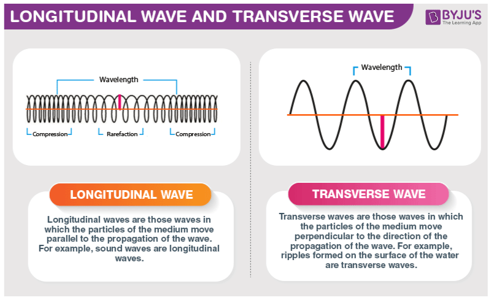

# Visual Guide: Wave Types and PDTP Framework

**Purpose:** This document uses images to explain the PDTP framework visually.
Each image maps a well-understood wave phenomenon to a specific part of the PDTP
structure. The goal is to build intuition that equations alone cannot provide —
a picture is worth a thousand words.

**Cross-references:** Part 28 (tensor GW), Part 28b (polarization analogy),
Part 28c ([wave_effects_pdtp.md](wave_effects_pdtp.md) — full catalog with equations).

---

## Image 1: The Two Fundamental Wave Types



**What the image shows:**

- **Left panel — Longitudinal wave:** The medium (shown as coils) compresses and
  expands *parallel* to the direction the wave travels. Think of sound: air pushes
  back and forth in the same direction the sound moves. The wave produces alternating
  zones of compression (coils bunched together) and rarefaction (coils spread apart).

- **Right panel — Transverse wave:** The medium oscillates *perpendicular* to the
  direction the wave travels. Think of a guitar string: the string moves up and down
  while the wave pattern travels sideways along the string.

These are not two descriptions of the same wave — they are two structurally different
types of motion.

---

### PDTP Mapping: The Two Sectors

The PDTP framework has exactly this same two-mode structure:

| Wave type | Direction of oscillation | PDTP equivalent | What it does |
|---|---|---|---|
| **Longitudinal** | Parallel to propagation | **φ scalar field — breathing mode** | Spacetime condensate pulsing in and out; carries the gravitational phase |
| **Transverse** | Perpendicular to propagation | **Tensor gravitational waves (+ and × polarizations)** | Spacetime stretching sideways; the waves LIGO detects |

**The critical insight this image makes visual:**

LIGO is built as two perpendicular arms in an L-shape. It is sensitive *only* to
sideways stretching — transverse motion. It is structurally blind to compression
and expansion along the direction of travel.

The φ breathing mode is **longitudinal**. It pulses in and out isotropically, like
sound, not like light. LIGO cannot see it by design — not because it is too weak,
but because the detector geometry is the wrong shape.

> **PDTP prediction (Part 28b):** The breathing mode requires a different detector
> geometry — either a triangular detector (like LISA) sensitive to isotropic
> expansion, or pulsar timing arrays which detect the Doppler shift from the
> longitudinal compression of the Earth-pulsar distance.

---

## Image 2: Both Modes at Once — The Circular Orbit


**What the image shows:**

A water particle at the ocean surface does not move like a pure longitudinal wave
(back and forth) or a pure transverse wave (up and down). It traces a **circle**.

The arrows in the diagram show why:

- **Transverse component** (vertical arrow): the particle moves up as a crest arrives,
  down as a trough passes — pure up/down motion
- **Longitudinal component** (horizontal arrow): the particle also moves forward
  under the crest and backward under the trough — pure back/forth motion

These two motions happen simultaneously and at 90° to each other. The result is a
circular orbit. Neither mode alone produces the circle — **both are required at
the same time.**

---

### PDTP Mapping: The cos(ψ − φ) Coupling

In PDTP, the matter field ψᵢ and the condensate field φ are coupled by:

```
L_coupling = gᵢ cos(ψᵢ − φ)
```

This term is the PDTP analogue of the circular orbit:

| Water wave element | PDTP element |
|---|---|
| Water particle | Matter field ψᵢ (the particle) |
| Ocean wave | Condensate φ (spacetime background) |
| Circular orbit | cos(ψᵢ − φ) coupling: both fields oscillating relative to each other |
| Orbit amplitude | Coupling constant gᵢ (strength of gravitational interaction) |
| cos(ψ−φ) = 1 | Perfect phase-lock: particle fully entrained in condensate (normal gravity) |
| cos(ψ−φ) → 0 | Phase decoupling: particle loses its orbit, exits the condensate (zero gravity) |

The circle is the physical picture of phase-locking. A particle locked to the
condensate completes its circular orbit. A particle that decouples never completes
the circle — it drifts free of the wave.

---

## Image 3: One Full Orbit — Phase-Locking in Action


**What the image shows:**

Five sequential frames of a floating buoy as a wave crest passes from right to left.
The buoy traces one complete circular orbit:

1. **Frame 1:** Buoy at rest, wave approaching from the right
2. **Frame 2:** Wave arrives; buoy starts moving forward and upward
3. **Frame 3:** Buoy reaches the top of its orbit (at the crest)
4. **Frame 4:** Buoy moves backward and downward (descending the back of the crest)
5. **Frame 5:** Buoy completes the circle and returns to its starting position

The buoy does not travel with the wave. It goes in a circle and ends up exactly
where it started. The wave passes through; the buoy is momentarily entrained
and then released.

---

### PDTP Mapping: The Phase-Lock Cycle

This is the most direct visual of what phase-locking means in PDTP:

| Buoy frame | PDTP description |
|---|---|
| Frame 1: buoy at rest, wave approaching | Matter particle in equilibrium: ψ = φ, cos(ψ−φ) = 1 |
| Frames 2–4: buoy in circular orbit | Particle oscillating with the condensate — gravitationally bound |
| Frame 5: buoy returns to start | One complete oscillation of the cos(ψ−φ) coupling cycle |
| One full orbit = one period | Period = 2π / ω_gap (breathing mode frequency) |
| Orbit radius | Proportional to gᵢ — stronger coupling = larger orbit |

**What happens if the orbit does not close?** If the buoy is pushed hard enough
that it does not return to its starting point — if it overshoots and drifts away —
it has escaped the wave. In PDTP terms, that is decoupling: the phase difference
ψᵢ − φ grows indefinitely, the cosine averages to zero, and gravity switches off.

This is the engineering picture behind Phase Decoupling (Goal 2 of the project):
give a particle enough energy to break its orbit from the condensate wave.

---

## Image 4: Depth Dependence — Vacuum, Coupling Zone, and Horizon


**What the image shows:**

**Left diagram:** The circular orbits from Image 3 shrink as you go deeper in the
water. At the surface the orbit is full-sized. At intermediate depth the orbit is
smaller. At deep water the orbit shrinks to zero — only longitudinal compression
remains, and even that decreases with depth. The wave action decreases with depth.

**Right photo (wave breaking):** When a wave approaches shallow water, the bottom
drags on the lower part of the wave, slowing it down. The crest is still moving
at full speed but the base slows — so the crest outruns the trough and spills over.
The wave breaks.

---

### PDTP Mapping: Three Zones

**Zone 1 — Deep water (longitudinal only, orbits gone):**

| Water | PDTP |
|---|---|
| Only longitudinal compression remains | Vacuum φ background — condensate present but no matter coupling |
| No circular orbits | cos(ψᵢ − φ) = 0 (no matter fields ψᵢ present) |
| Wave energy still propagates | φ field still carries energy; T_μν^φ nonzero |

This is the vacuum state. The φ condensate permeates all of space even where
there are no particles, just as the ocean's longitudinal compression extends to
the deep seabed with no circular orbits.

**Zone 2 — Surface (full circular orbits):**

| Water | PDTP |
|---|---|
| Full circular orbits at surface | Matter-condensate coupling zone: cos(ψᵢ − φ) ≠ 0 |
| Both longitudinal and transverse active | Both scalar (φ) and tensor (GW) sectors active |
| Orbit size = wave amplitude | Coupling strength gᵢ = gravitational interaction |

This is the region around a massive body — the gravitational field. Near a planet,
both the breathing mode (longitudinal) and gravitational waves (transverse) exist
together, and the matter is fully entrained in the condensate.

**Zone 3 — Wave breaking (crest outruns trough):**

| Water | PDTP analogy |
|---|---|
| Bottom drag slows the lower wave | Infalling matter slows near a gravitational horizon |
| Crest moves faster than trough | Coordinate time slows for lower-energy (closer) matter |
| Wave breaks: crest spills over | Horizon: the wave pattern cannot maintain coherence |
| Water mixes chaotically | Hawking radiation? — condensate loses phase coherence at horizon |

> **Caution:** The wave-breaking → horizon analogy is qualitative, not derived.
> It is a visual aid, not a calculation. The quantitative horizon result is in
> Part 24 (Hawking temperature from acoustic horizon).

The key image: the ocean wave breaks because the bottom and top move at different
speeds. A gravitational horizon forms because different layers of spacetime move at
different effective speeds. The crest-outruns-trough picture shows *why* horizons
are not walls — they are regions where a wave can no longer hold its shape.

---

## Summary: The Complete PDTP Two-Sector Structure

All four images together build the complete picture:

| Image | Wave phenomenon | PDTP sector | Key equation |
|---|---|---|---|
| 1 — L vs T diagram | Two distinct wave types | Two sectors: φ (scalar) and tensor GW | L = ½(∂φ)² + Σ gᵢ cos(ψᵢ−φ) |
| 2 — Circular orbit | Both modes simultaneous | cos(ψ−φ) coupling = combined orbit | α = cos(ψ−φ): α=1 gravity, α→0 decoupled |
| 3 — Buoy orbit cycle | One complete phase-lock cycle | ω_gap oscillation of cos(ψ−φ) | ω_gap = m_cond c² / ħ |
| 4 — Depth + breaking | Vacuum / coupling zone / horizon | Vacuum (φ only) / matter zone / horizon | T_μν^φ = 0 (vacuum), ≠ 0 (excited) |

---

## Why This Two-Mode Structure Matters for Detectors

The images make the detector problem concrete:

**LIGO sees only the transverse mode (Image 1, right panel):**
LIGO's L-shaped arms detect sideways stretching — the + and × polarizations of
tensor gravitational waves. This is the right-panel wave in Image 1.

**LIGO is blind to the breathing mode (Image 1, left panel):**
The φ breathing mode compresses and expands isotropically — like the left panel
in Image 1. LIGO arms all get compressed or expanded equally, so the differential
signal is zero. LIGO cannot distinguish "all arms got longer by 1%" from "nothing
happened."

**What can detect the breathing mode:**

| Detector | Why it works | Analogy |
|---|---|---|
| Pulsar timing array | Measures Doppler shift in Earth-pulsar distance — longitudinal | Measuring the compression of the distance itself |
| LISA (triangular) | Three arms at 60° — sensitive to isotropic breathing | A triangle distorts differently under isotropic vs shear stress |
| Einstein Telescope | Triangular configuration, broader band | Same principle as LISA but ground-based |

Until a triangular detector or pulsar timing array finds the breathing mode signal,
the PDTP scalar sector prediction remains untested. The current LIGO null result
for breathing modes does not constrain PDTP — it is consistent with the PDTP
prediction that LIGO would see nothing.

---

## Seismology: The Sharpest Real-World Analogy

Earthquake physics already uses exactly the P/S/L classification that PDTP needs.
Seismologists solved this problem decades ago — they had to build different detectors
for each wave type because the same instrument cannot detect all three.

**Source:** [Seismic wave — Wikipedia](https://en.wikipedia.org/wiki/Seismic_wave)

**Source:** [VisualPhysics — Travelling Waves (Module 31)](https://d-arora.github.io/VisualPhysics/mod31/m31_tw.htm) —
educational reference with diagrams of P, S, and L wave types, tsunami depth profiles,
and animated wave motion. Used here as a visual reference for wave type classification.

### The Three Earthquake Wave Types

| Seismic wave | Motion type | Physics | PDTP equivalent |
|---|---|---|---|
| **P-wave** (Primary) | Longitudinal — compression and rarefaction along propagation | Travels through any medium; fastest; arrives first | **φ breathing mode** — isotropic compression of spacetime condensate |
| **S-wave** (Secondary) | Transverse — shear perpendicular to propagation | Travels only through solids; arrives second | **Tensor GW** — the + and × polarizations; what LIGO detects |
| **L-wave** (Love/Rayleigh, Surface) | Mixed elliptical, confined to surface | Slowest; most destructive; combines both | **Matter-condensate coupling zone** — both sectors active near a massive body |

### Why This Analogy Is Stronger Than Ocean Waves

Ocean waves are a qualitative illustration. Earthquake waves are a quantitative,
well-studied case where the same medium supports all three wave types simultaneously
and requires different detector geometries for each.

**The seismograph problem mirrors the LIGO problem exactly:**

A seismograph sensitive only to horizontal shear (S-waves) — like a pendulum swinging
side to side — is completely blind to vertical P-wave compression. The ground can be
bouncing up and down rhythmically and the horizontal seismograph records nothing.

LIGO's L-shaped arms are the gravitational wave equivalent of a horizontal seismograph:
exquisitely sensitive to shear (S-wave / transverse / tensor GW), structurally
insensitive to compression (P-wave / longitudinal / φ breathing mode).

This is not a limitation of LIGO's sensitivity — it is a limitation of its geometry.
A detector shaped differently (triangle, sphere) would be needed to see the P-wave
equivalent in spacetime.

**The depth falloff also appears in seismology:**

P-waves and S-waves propagate through the full volume of the Earth (bulk waves).
L-waves are confined to the surface and decay exponentially with depth — exactly
like the orbit-shrinking in Image 4. In PDTP terms:

- Bulk P-waves (volume) → φ condensate pervading all of spacetime (vacuum background)
- Surface L-waves (depth-confined) → matter coupling only near a massive body

### Detector Comparison: Seismology vs Gravitational Waves

| Phenomenon | Seismology | Gravitational waves | PDTP breathing mode |
|---|---|---|---|
| Longitudinal (P) detector | Vertical seismograph | *None yet* (spherical or pulsar timing) | *None yet* |
| Transverse (S) detector | Horizontal seismograph | LIGO (L-shaped arms) | Not applicable |
| Surface (L) detector | Broadband seismograph at surface | Not applicable | Not applicable |

The gap in the gravitational wave column — no longitudinal (P-wave) detector yet
exists — is precisely where the PDTP breathing mode prediction lives.

---

## Connection to Phase Decoupling (Goal 2)

The buoy orbit in Image 3 is also the picture for the engineering goal:

- **Normal gravity:** buoy completes its orbit, returns to start — fully phase-locked
- **Decoupling:** give the buoy enough velocity that it escapes the orbit entirely —
  the orbit does not close; the particle no longer tracks the condensate wave

In PDTP terms, decoupling requires breaking the cos(ψ−φ) coupling:
driving ψ − φ so large that the cosine averages to zero. The energy cost is
approximately gᵢ per oscillator (Part 28b). The challenge is not the total energy
(approximately 10 kW/ton — Part 29), but finding a *mechanism* to drive the phase
difference continuously without the condensate pulling ψᵢ back into phase-lock.

The circular orbit picture makes this concrete: you need to break a buoy free of a
wave, not just push it up temporarily. Temporary pushes just create a larger orbit
that still returns to start. True decoupling requires a net drift in ψ − φ that
does not reverse.

---

**Sources:**

- [Longitudinal wave — Wikipedia](https://en.wikipedia.org/wiki/Longitudinal_wave)
- [Transverse wave — Wikipedia](https://en.wikipedia.org/wiki/Transverse_wave)
- [Surface wave — Wikipedia](https://en.wikipedia.org/wiki/Surface_wave)
- [Seismic wave — Wikipedia](https://en.wikipedia.org/wiki/Seismic_wave)
- [VisualPhysics — Module 31 Overview](https://d-arora.github.io/VisualPhysics/mod31.htm) — Ian Cooper; NSW Year 11–12 curriculum; wave types, properties, and phenomena
- [VisualPhysics — Travelling Waves](https://d-arora.github.io/VisualPhysics/mod31/m31_tw.htm) — P/S/L wave diagrams, tsunami depth profiles, animated wave motion
- **PDTP Original:** Two-sector mapping (scalar/tensor), cos(ψ−φ) = circular orbit analogy,
  depth-profile → vacuum/coupling-zone/horizon structure, LIGO blind spot argument,
  seismology P/S/L → PDTP breathing/tensor/surface analogy
- Cross-references: Part 28b (polarization analogy, LIGO blind spot derivation),
  Part 24 (Hawking temperature), Part 29 (decoupling energy estimate)
