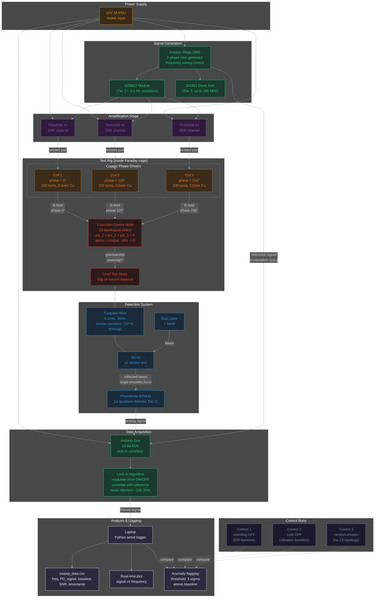

# 3Y Test Rig — Signal Flow Diagram

## Signal Path Summary

1. **Generation:** Arduino Mega generates 3 sine waves at 120° phase offset, sweeping frequency
2. **Amplification:** TDA2030 boards amplify each channel to drive coils
3. **Excitation:** 3 copper coils create oscillating B-fields converging at Y-junction centre
4. **Physics:** At centre node, Z3 phase cancellation forces alpha → 0 (if resonant frequency found)
5. **Detection:** Any gravitational anomaly torques the torsion balance, rotating the mirror
6. **Readout:** Laser reflects off mirror to photodiode — angle change = spot displacement
7. **Filtering:** Lock-in amplifier correlates signal with drive modulation, rejecting noise
8. **Analysis:** Python logs data, flags any frequency where signal exceeds 3-sigma threshold
9. **Validation:** 3 control runs establish baselines; only signals present WITH shielding AND Z3 topology count
